我的上一篇文章[完美黑暗模式如何诞生？](/2022/04/完美黑暗模式如何诞生？)是关于本站黑暗模式的技术细节，可是在上线后实际体验并不是十分完美。

## 什么打破了这份完美？


如你所见的这个小按钮，它专用于切换网站主题。我在阅读《完美黑暗模式如何诞生？》这篇文章时，使用它切换到黑暗模式，出现掉帧！大乌龙啦！
ok，有问题是好事儿，办法总比困难多，把它揪出来！

## 追根溯源

> 前置知识：[狙杀页面卡顿 Performance 指北 - 引自掘金@凯大胳膊](https://juejin.cn/post/6844903651262070791)

chrome 拥有多项工具来帮助开发者分析自己的程序，找出 bug。例如 console 可以帮助我们查看代码执行结果，network 可以让我们看到网页所有资源的请求信息，
lighthouse 帮助我们分析网站加载性能，seo 等等。而今天的主角`Performance`则可以帮我们记录页面每一帧渲染发生了什么。

**首先确定卡顿的页面：《完美黑暗模式如何诞生？》,接下来都以`问题页面`代指。在我的首页和其他位置切换黑暗模式都不会出现卡顿现象。锁定！**
话不多说，下面是我在问题页面录制从白天模式切换到黑夜模式的全过程。

<FullBleed aspectRatio={2.82} >
  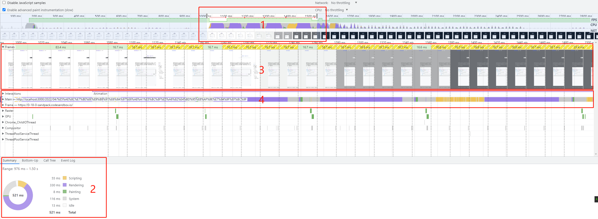
</FullBleed>

上面的图比较复杂，第一次看的人肯定头都大了。不要害怕，我们按照图中标明顺序进行分析。

### 1. 定位区间

为了保证分析的准确性，首先需要定位到我们要分析的位置，也就是主题切换开始到结束的时间片段。

**最直观的便是下方截图区域，可以直观看到页面主题在此时间段完成切换。**
在此时间段中，**FPS图出现下降和CPU占用出现高峰，与之对应，最上方也出现了红色条形标记，表示页面在此区间出现了`long task`。
我们最终目的就是找到`long task`出现的原因并优化它们。**

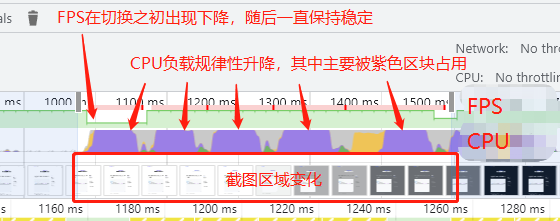

### 2. 总览分析

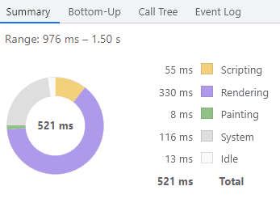

**浏览器据我们选择的时间区间，展示对应总览数据。据此我们可以知道脚本执行，浏览器渲染，绘制,空闲(idle)等类型任务各自占用的具体时间。
我们选择的976ms-1.5s这个区间，紫色的Rendering区块耗费330ms，占用总时长的63.3%，这个比例相当夸张！！为什么说夸张，先看看另外一个常见场景**

另外一个常用场景，**滑动浏览百度搜索的结果，结果是渲染时长占比非常低，仅有0.6%。浏览器的渲染能力很强大，正常浏览网页的过程中，渲染耗时只占浏览器计算资源的小部分。**

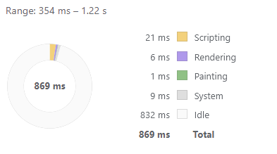

通过上面的分析，我们大致知道Rendering时间超长可能是造成页面卡顿的原因。

### 3. 帧数表现

上文我们提到肉眼感知到卡顿，下面通过从录制数据查看卡顿的具体程度。

<FullBleed aspectRatio={9} >
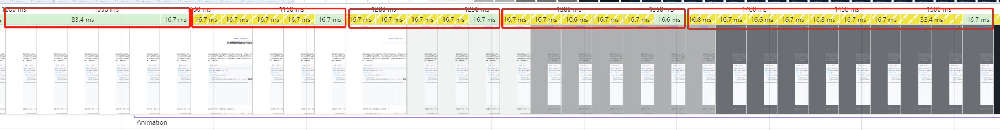
</FullBleed>

从左到右，我手动划分了5个区块。

- 第一个区块：帧数的下降到1000ms/83.4ms=11fps。
- 中间三个区块：呈现为4个黄色区块+1绿色区块的规律重复。黄色部分代表，浏览器未能完成这一帧画面绘制，只呈现已完成的部分。直到新的一帧画面完整绘制，绿色区块出现。
表面上这些区块中每一帧画面都是16.7ms，实际一帧完整画面的出现仍然花费83.5ms，所以平均帧数依然约为11fps。
- 最后一个区块：耗费更长的时间完成了新一帧的渲染，帧数必然低于11fps。

从上分析来看，切换的过程始终保持极低的帧数，带来了不好的用户体验。

### 2. 主线程分析

<FullBleed aspectRatio={7} >
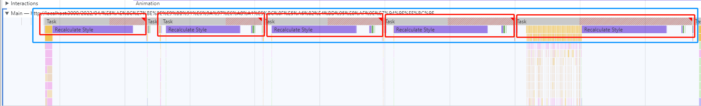
</FullBleed>

主线程上5个连续的红色标记，根据瀑布图，我们可以看到`long task`下主要耗时任务是`Recalculate Style`这个任务，选中其中一个查看详情。

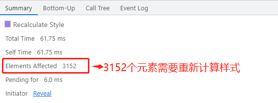

可以明显看到，我们切换主题的过程中，浏览器需要为3152个元素重新计算样式(Recalculate Style)，总耗时61.75ms。
远远大于我的显示器流畅显示条件(一帧不超过16.7ms)，直接造成切换主题卡顿掉帧。

## Recalculate Style执行久的原因

什么原因导致`Recalculate Style`影响元素达到3000多个呢？

切换主题的主要变化的样式仅有css变量，颜色的变化使得浏览器需要进行重绘(repaint)。
所有使用css变量的元素都需要重新计算样式(Recalculate Style)，影响的元素竟然达到3000之多。

#### 假设1：使用css变量的元素太多

**我分析的第一个原因是3000个元素的重绘对浏览器来说压力太大了！
在我的网站中，所有页面都使用header和footer这一公用组件。但只有在出现卡顿，因此排除公用组件的锅！
问题页面的内容中有大量使用css变量的地方吗？**

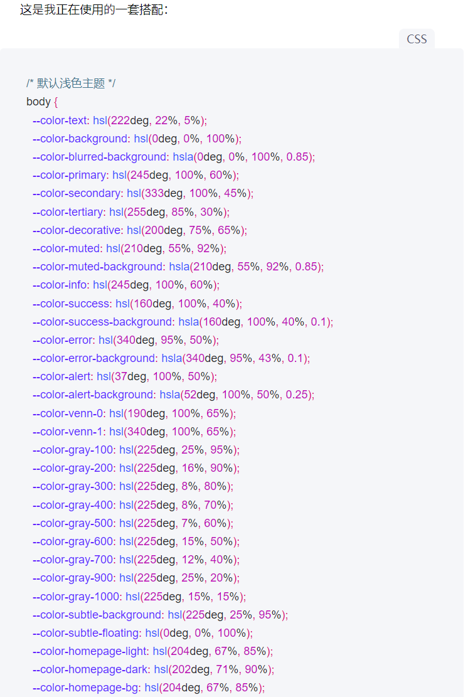

最终发现了一个超长的代码块，其中每一个单词和符号都使用了css变量，粗略计算约有1000+元素会在切换主题式重新计算样式。

**我尝试删除了这段超长的代码块，并重复录制主题切换过程。肉眼感受变得更加流畅了！**

**定位到相同位置，可以看到帧率同样具有波动，但下限得到提高。cpu面积图中，紫色仍然占据大部分负载。**
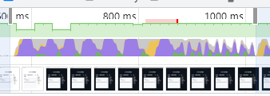

**更细节的地方，重绘样式的元素减半，相应的花费时间也减半。但是，绘制时间仍然大于16.7ms。**
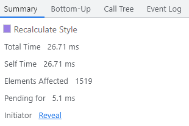

**上面的优化虽然有一定的效果，但仍然达不到理想值！而且，想要达到流畅的效果，总不能靠缩减文章的内容吧！**

#### 假设2：css过渡动画出现问题

主要问题在于颜色切换的过渡出现了卡顿。为了不让切换过程过于突兀，我在网站添加以下代码：

```css
transition: color 350ms ease 0s, background 350ms ease 0s;
```

我在不止一个组件中添加了上面的代码，这段代码本身没有问题，但是像下面这样使用就会造成大问题！

```css
.CodeSnippetOuterWrapper{
  position: relative;
  margin: 48px auto;
  & * {
      transition: background 300ms ease, color 200ms ease;
  }
}
```

`CodeSnippetOuterWrapper`是我的代码块组件的外层容器，我是用了通配符为所有的子元素添加了过渡动画！！
这意味着，主题切换时，浏览器需要为代码块中的每个元素执行过渡动画，直接拉低了网站性能。

```css
.CodeSnippetOuterWrapper{
  position: relative;
  margin: 48px auto;
  /* & * {
      transition: background 300ms ease, color 200ms ease;
  } */
}
```
那么我们注释掉这段使用通配符的css,重复录制，奇迹发生了！

切换过程帧数稳定，没有出现任何波动！
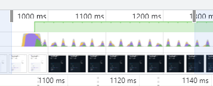

在总览事件饼图中，渲染事件仅耗费36ms！占比11%，还算不错的成绩！浏览器空闲时间(idle)占比80%。看来浏览器瞬间就轻松了不少呢！
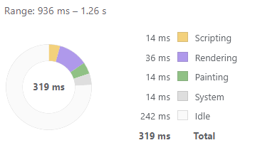

例行的计算样式，在我没有删除假设1中的文章片段情况下，仍然只耗费16.7ms，刚好达到流畅的标准！
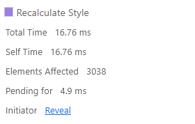

那么至此，一行样式引发的性能问题终于得到了解决！

## 总结

1. 写文章尽量尝试编写伪代码，精简达意即可，超长的代码块不仅难看，还耗费性能！
2. 通配符+transition不仅会引发性能问题，还不好排查！

为了找到这段问题代码，我足足花费了一周的时间，当然其中还包括学习performace的时间。
除了学习performance的用法，更难的是去理解录制结果所代表现象以及现象背后深层次的原因。
最后，即便借助performance我发现问题在于Recalculate Style时间超长，
在寻找原因的路上，我尝试了许多的方法，各种删改自己的代码，最终都以失败告终。
有时候，无心插柳柳成荫。某天清晨，突发奇想删除了一段代码。竟无意修复了问题，
这种有无比的欣喜和懊恼交加的感觉甚是奇妙！！最后我收获的不仅是一个bug的终结，而是往前探索的勇气和快乐！
还有，新的文章题材哈哈哈！

这段经历中，还有很多值得探索的点！例如：
1. 浏览器的渲染过程，重绘与回流，这能让我更好的理解performance的录制结果
2. 统配符为何会对性能造成影响？

请期待我的更新！