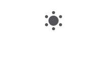

黑暗模式自诞生以来，迅速得到各大操作系统及应用的支持，已经属于非常常见的功能。这篇文章则是我对黑暗模式的探索与发现！

可以说黑暗模式在 web 端的应用已经非常成熟了，其中的关键就是 css 变量, 这里有一个简单的例子：

<Codebox
  template="react"
  files={{
    "/App.js": `import './index.css'
import React,{useState} from 'react'
export default ()=>{
  const [theme, setT] = useState('light')
  return <div className={theme}  >
     <h1>hello</h1>
     <button onClick={()=>{setT(()=>theme==='light'? 'dark' : 'light')}} >切换主题</button>
    </div>
}
`,
    "/index.css": `
div.light {
  --theme-bg: white;
  --font-color: black;
}
div.dark {
  --theme-bg: black;
  --font-color: white;
}
html,body {
  padding:0;
  margin:0;
}
div {
  height: 100vh;
  width:100vw;
  display:flex;
  align-items:center;
  justify-content:center;
  flex-direction:column;
  background: var(--theme-bg);
  color: var(--font-color);
}
    `,
  }}
/>

很简单吧。完成一个主题功能，大致需要 3 步：

1. 在顶层元素配置黑暗/白天模式一套统一命名的 css 变量,通过 calss区分每个变量对应不同主题的值。
2. css变量具有作用域，自身及所有子元素都可以访问。于是，我们可以在应用中任何颜色都需要使用预设的 css 变量，例如：背景色，字体颜色，等等。
3. 添加 toogle 按钮以切换顶层元素 class，css变量得到响应式的更新，将会使得页面中使用到该变量的属性值得到更新，于是主题切换完成。

了解原理之后，我们详细梳理一下需要做的功能吧：

- 获取预设的主题。用户进入我们的应用，所应该展示的初始主题。
- 一个展示与切换按钮，帮助用户得知当前主题以及根据偏好切换主题。
- 持久化保存用户的偏好，确保下次访问不用重设。

## 预设主题

用户初次进入网站，我们将为其呈现何种主题模式呢？

通常，我们有三个途径可以获取用户所需求的主题模式，优先级逐渐降低：

1. 用户历史设置的主题模式
2. 系统的当前设置
3. 网站默认主题

```js
export const getInitalColorMode = () => {
  // 获取初始的主题
  const persistedColorPreference = window?.localStorage.getItem("color-mode");
  const hasPersistedPreference = typeof persistedColorPreference === "string";

  // 1. 识别用户的历史主题
  if (hasPersistedPreference) {
    return persistedColorPreference;
  }

  // 2. 如果不存在用户的偏好，查询系统设置
  const mql = window?.matchMedia("(prefers-color-scheme: dark)");
  const hasMediaQueryPreference = typeof mql.matches === "boolean";

  if (hasMediaQueryPreference) {
    return mql.matches ? "dark" : "light";
  }

  // 3. 默认返回白天模式
  return "light";
};
```

所以，我们现在可以得到初始主题。

## 主题展示与切换

有了初始主题。我们还需要这些：

1. 当前主题的变量(colorMode)，便于向用户展示正确的当前主题模式。
2. 一个切换主题的函数(toggleColorMode)。用户通过触发这个函数调整自己喜好的模式。

这里我使用`React.Context` + `React.useState`对子组件共享上述内容。

```js
const getInitalColorMode = () => {
  /* 详情参上 */
};

export const ThemeContext = React.createContext();

const ThemeProvider = ({ children }) => {
  // 当前主题
  const [colorMode, setColorMode] = React.useState(getInitalColorMode);

  // 设置主题
  function setMode(value) {
    setColorMode(value);
    // 本地持久化
    window.localStorage.setItem("color-mode", value);
    let bodyClass = window.document.body.classList;
    value === "dark" ? bodyClass.add("dark") : bodyClass.remove("dark");
  }

  // 主题切换函数
  function toggleColorMode() {
    let currentMode = colorMode === "dark" ? "light" : "dark";
    setMode(currentMode);
  }

  return (
    // 向子组件共享状态
    <ThemeContext.Provider value={{ colorMode, toggleColorMode }}>
      {children}
    </ThemeContext.Provider>
  );
};
```

接下来，我们在子组件中就可以对当前主题进行展示和切换啦！就像这样

```js
import { ThemeContext } from "lib/theme";

const Header = () => {
  const { colorMode, toggleColorMode } = React.useContext(ThemeContext);
  const isDark = colorMode === "dark";
  return (
    <div>
      // 省略非关键代码...
      <ThemeButton
        dark={isDark}
        title={isDark ? "黑夜模式" : "白天模式"}
        onClick={toggleColorMode}
      />
    </div>
  );
};
```

我在页面header部分添加图标按钮用于展示当前主题，并添加切换功能，帮助用户进行模式切换。这里我还制作了一个有趣的切换动画。你可以发挥想象力，做出更有趣的内容！



可以看到，我们的代码可以完美的工作！这意味着我们已经完成逻辑部分的工作啦！接下来只需要在 body 元素上配置对应的色彩变量即可。

## 色彩变量配置

色彩可以说是网站的核心要素之一，精致的内容+合理色彩搭配可以给用户带了优秀的体验。

### 如何搭配色彩

也许对一个程序员来说，最难的不是开发，而是如何搭配出一整套视觉体验舒适的颜色。相比于设计师，如何搭配颜色这并不是我们擅长的。
除了求助设计师，我选择了更为简单快捷的方式：主流网站其实早就拥有一套成熟的色彩搭配。使用他们的颜色搭配，可以使得我们专注于如何设计一个主题切换系统。

这是我正在使用的一套搭配：

```css
/* 默认浅色主题 */
body {
  --color-text: hsl(222deg, 22%, 5%);
  --color-background: hsl(0deg, 0%, 100%);
  --color-blurred-background: hsla(0deg, 0%, 100%, 0.85);
  --color-primary: hsl(245deg, 100%, 60%);
  --color-secondary: hsl(333deg, 100%, 45%);
  --color-tertiary: hsl(255deg, 85%, 30%);
  --color-decorative: hsl(200deg, 75%, 65%);
  --color-muted: hsl(210deg, 55%, 92%);
  --color-muted-background: hsla(210deg, 55%, 92%, 0.85);
  --color-info: hsl(245deg, 100%, 60%);
  --color-success: hsl(160deg, 100%, 40%);
  --color-success-background: hsla(160deg, 100%, 40%, 0.1);
  --color-error: hsl(340deg, 95%, 50%);
  --color-error-background: hsla(340deg, 95%, 43%, 0.1);
  --color-alert: hsl(37deg, 100%, 50%);
  --color-alert-background: hsla(52deg, 100%, 50%, 0.25);
  --color-venn-0: hsl(190deg, 100%, 65%);
  --color-venn-1: hsl(340deg, 100%, 65%);
  --color-gray-100: hsl(225deg, 25%, 95%);
  --color-gray-200: hsl(225deg, 16%, 90%);
  --color-gray-300: hsl(225deg, 8%, 80%);
  --color-gray-400: hsl(225deg, 8%, 70%);
  --color-gray-500: hsl(225deg, 7%, 60%);
  --color-gray-600: hsl(225deg, 15%, 50%);
  --color-gray-700: hsl(225deg, 12%, 40%);
  --color-gray-900: hsl(225deg, 25%, 20%);
  --color-gray-1000: hsl(225deg, 15%, 15%);
  --color-subtle-background: hsl(225deg, 25%, 95%);
  --color-subtle-floating: hsl(0deg, 0%, 100%);
  --color-homepage-light: hsl(204deg, 67%, 85%);
  --color-homepage-dark: hsl(202deg, 71%, 90%);
  --color-homepage-bg: hsl(204deg, 67%, 85%);
  --syntax-bg: hsl(225deg, 25%, 97%);
  --syntax-highlight: hsl(225deg, 25%, 93%);
  --syntax-txt: #2a2a2a;
  --syntax-comment: #467790;
  --syntax-prop: #da0079;
  --syntax-bool: #bf00b8;
  --syntax-val: #78909c;
  --syntax-str: #651fff;
  --syntax-name: #aa00ff;
  --syntax-del: rgb(255, 85, 85);
  --syntax-regex: #3600d6;
  --syntax-fn: #3d5afe;
}

/* 深色模式 */
body.dark {
  --color-text: hsl(0deg, 0%, 100%);
  --color-background: hsl(210deg, 30%, 8%);
  --color-blurred-background: hsla(210deg, 30%, 8%, 0.85);
  --color-primary: hsl(230deg, 100%, 67%);
  --color-secondary: hsl(333deg, 100%, 52%);
  --color-tertiary: hsl(53deg, 100%, 50%);
  --color-decorative: hsl(200deg, 50%, 60%);
  --color-muted: hsl(210deg, 38%, 15%);
  --color-muted-background: hsla(210deg, 38%, 15%, 0.85);
  --color-info: hsl(230deg, 100%, 67%);
  --color-success: hsl(160deg, 100%, 40%);
  --color-success-background: hsla(160deg, 100%, 40%, 0.1);
  --color-error: hsl(340deg, 95%, 60%);
  --color-error-background: hsla(340deg, 95%, 43%, 0.1);
  --color-alert: hsl(30deg, 100%, 50%);
  --color-alert-background: hsla(38deg, 100%, 50%, 0.1);
  --color-venn-0: hsl(190deg, 100%, 65%);
  --color-venn-1: hsl(175deg, 100%, 50%);
  --color-gray-100: hsl(210deg, 15%, 20%);
  --color-gray-200: hsl(210deg, 15%, 25%);
  --color-gray-300: hsl(210deg, 10%, 40%);
  --color-gray-400: hsl(210deg, 9%, 45%);
  --color-gray-500: hsl(210deg, 8%, 50%);
  --color-gray-600: hsl(210deg, 12%, 55%);
  --color-gray-700: hsl(210deg, 14%, 66%);
  --color-gray-900: hsl(210deg, 25%, 88%);
  --color-gray-1000: hsl(210deg, 25%, 96%);
  --color-subtle-background: hsl(210deg, 30%, 8%);
  --color-subtle-floating: hsl(210deg, 22%, 15%);
  --color-homepage-light: hsla(200deg, 100%, 85%, 0);
  --color-homepage-dark: hsla(200deg, 100%, 85%, 0.1);
  --color-homepage-bg: hsl(210deg, 30%, 8%);
  --syntax-bg: hsl(210deg, 30%, 12%);
  --syntax-highlight: hsl(210deg, 30%, 18%);
  --syntax-txt: #fff;
  --syntax-comment: #6c8998;
  --syntax-prop: #ff39a8;
  --syntax-bool: #ffd600;
  --syntax-val: #61747d;
  --syntax-str: rgb(155, 109, 255);
  --syntax-name: #c653ff;
  --syntax-del: #ff5555;
  --syntax-regex: #ffd700;
  --syntax-fn: rgb(0, 190, 255);
}
```

如果你想要拥有自己的色彩搭配，可以根据视需求自己设定，个人总结的思路，常用的色彩主要分为几类：

1. 主题色。这代表网站的主要风格，可以在网站的主要元素使用。
2. 背景色。
3. 字体颜色。通常是若干个由浅到深，由灰到黑的系列色，用于区别文字的主次。
4. 词法颜色。作为博客网站，我还为代码块的各类词法配置色彩，帮助文章中的代码块更加清晰易读。
5. 提示性色彩。例如: 警告色(黄)，成功色(绿色)，出错了(红色)。

只要完成以上几类色彩的搭配，你也可以拥有一套称心的主题。

## 大功告成？

回到正题，完成上面的工作后，我们的主题功能已经可以正常工作了！就像这样。


一个藏起来的问题我们还没有解决，让我们使用一些手段来抓住它！

### 不友好的问题

当你选择黑暗模式并刷新当前页面时，一些不太友好的体验出现了！


页面出现了明显的闪烁，仿佛是白天一瞬间切换到了黑夜。
试想一下，用户访问页面的过程。

1. 浏览器请求服务器并获取 html，**服务器并不知道客户端的主题模式，因此此时默认的 html 是白天模式**。
2. 获取到 html 后端，浏览器对 html 进行解析并渲染，此时页面默认为白天模式。
3. javascript 被浏览器执行，`getInitalColorMode `执行，于是页面切换为黑暗模式！

此时，我们的页面html结构如下：

```html
<body>
  <!-- body没有class，默认为浅色主题 -->
  <div>
    <!-- 页面内容 -->
  </div>
  <script>
    /*
      - getInitalColorMode获取初始化主题并设置
    */
  </script>
</body>
```
**问题在于页面内容被渲染出来时，使用了默认的白天模式 css 变量值。此时由于getInitalColorMode还未执行，等页面内容渲染完成后，它姗姗来迟。因此页面由白天模式快速切换到黑暗模式，闪烁由此出现！**

正确的结果是：
**我们需要在页面内容被浏览器渲染之前，就获取到正确的主题模式并完成设置！这样用户第一眼看到的内容，就将以黑暗模式进行呈现。**

我们知道通常将 javascript 放在 body 标签最后，是因为 javascrpit 执行会阻塞浏览器，我们不希望javascrpit影响页面内容的渲染。
但是放在这个问题中，如果将初始化主题这段 javascrpit 放在页面内容渲染之前，内容在渲染之前就能得到正确的主题模式。完美！

```html
<body>
  <script>
    /* 初始化主题 */
    function getInitialColorMode() {
      /* 同上 */
    }
    const colorMode = getInitialColorMode();
    // 切换主题
    let bodyClass = window.document.body.classList;
    colorMode === "dark" ? bodyClass.add("dark") : bodyClass.remove("dark")
  </script>
  <div>
    <!-- 页面内容 -->
  </div>
</body>
```

只需要简单的几行代码，就可以解决这个问题啦！我的博客采用SSR框架Next.js进行开发，看一下在Next.js的实际应用吧！

## 在Next.js使用主题

Next.js将完整的页面在服务端(node环境中)渲染完成后将完整HTML发送至客户端进行渲染。

### 调整获取预设主题时机

由于服务端渲染时，node环境中不存在window变量，因此getInitalColorMode的执行会得到错误的结果。

因此，我将其放到`React.useEffect`中，使其在浏览器dom渲染完成后进行获取。

```js
const ThemeProvider = ({ children }) => {
  // 当前主题
  const [colorMode, setColorMode] = React.useState();
  
  // 初始化完成后
  useEffect(() => {
    setMode(getInitalColorMode())
  }, []);
 
  // 省略历史代码...
  return (
    <ThemeContext.Provider value={{ colorMode, toggleColorMode }}>
      {children}
    </ThemeContext.Provider>
  );
};
```

### 自定义document

`_document.js`是Next.js提供给我们自定义html结构的文件，我们可以像下面这样编写。

```js _document.js
import Document, { Html, Head, Main, NextScript } from 'next/document'
let initalMode = `(()=>{
  /* 初始化主题 */
  function getInitialColorMode() {
    /* 同上 */
  }
  const colorMode = getInitialColorMode();
  let bodyClass = window.document.body.classList
  colorMode === "dark" ? bodyClass.add("dark") : bodyClass.remove("dark")
})()`;
class AntDocument extends Document {
    render() {
        return (
            <Html lang="zh" >
                <Head>
                </Head>
                <body>
                    <script dangerouslySetInnerHTML={{ __html: initalMode}} >
                    </script>
                    <Main />
                    <NextScript />
                </body>
            </Html>
        )
    }
}

export default MyDocument
```

我们使用立即执行函数(IFEE)防止其中的变量污染全局，`dangerouslySetInnerHTML`是React为浏览器提供的innerHtml替代方案，目的是为了将字符串原样显示，防止xss攻击。
上面的函数使得我们得到了正真完美的黑暗模式！看看效果：


## Tips

黑暗模式是一个有意思的话题，与其相关的也可以延延伸出有很多有意思的内容可以继续探讨！

### 切换小动画

我的主题切换动画是是基于svg+react-spring进行实现的。

**svg**：矢量图形可以保障我的图标在任何分辨率的设备上都得到高质量的呈现，还能够让我实现动画效果，是一种很有趣的技术。

**react-spring**：基于弹簧物理的react动画库，同时也是react官方推荐的动画库之一。一番体验下来，
相比于原生css3动画，基于弹簧物理的所呈现的动画效果，会更加贴近真实，体验更加良好，但是调节参数调节会比较花费时间。想要用好它，还得花更多的时间进行学习。

### HSL 色彩模式

你可能对 HSL 少有耳闻，但 RGB 你一定听说过。RGB 将任何一种色彩都以三原色以不同比例混合得到。浏览器对 RGB 的支持也可以说非常完美。
但是对于人类来讲，给你一种颜色，你会很难想象这到底三原色以怎样的比例组成。
因此，当我需要一个浅蓝色的 css 变量，我的脑袋里出现了`rgb(?,?,?)`。

与之 RGB 相对，HSL 以更加直观的方式表述了颜色

> HSL 是色相（Hue）、饱和度（Saturation）和亮度（Lightness）这三个颜色属性的简称。 参考-[HSL 色彩空间是什么？](https://miao.wondershare.cn/article/editing/hsl-secaikongjian.html)

1. 色相（Hue）是色彩的基本属性，就是人们平常所说的颜色名称，如紫色、青色、品红等等。我们可以在一个圆环上表示出所有的色相。色环上的 0°、120°、240° 位置，分别对应了 RGB 模型的红、绿、蓝三原色。
2. 饱和度，指色彩纯度，以红色为例，饱和度越高，颜色约深，饱和度低，最终都会接近灰色。
3. 亮度，指色彩明暗。亮度越高，色彩越接近白色，低则接近黑色。

知道了色相和色环的概念，我们可以很快得到自己所需颜色的值或者系列色。
例如我需要得到一个文字系列色。

使用HSL得到系列色的的逻辑是：
1. 先得到一个颜色
2. 调整亮度得到系列色

那么按照这个逻辑：
1. 先得到灰色，饱和度很低的情况下，任何色相都可以被转化成灰色。于是得到HSL(220deg, 10%, ?)，220deg是随意取的值。10%才是关键。
2. 剩下一个亮度参数怎么调节呢？不难得到，亮度越高，就能得到越浅的灰色甚至白色，亮度越低则越黑。

于是，很快就得到一个系列灰色。

```css
--gray-100: hsl(220, 10%, 90%)  // 浅浅灰
--gray-300: hsl(220, 10%, 70%)  // 浅灰
--gray-500: hsl(220, 10%, 50%)  // 灰
--gray-700: hsl(220, 10%, 30%) // 深灰
--gray-900: hsl(220, 10%, 10%) // 深黑
```

可以看到HSL很直观，我们可以通过简单的思考就得到自己想要的色值。与之相反，也能很快通过HSL值反推出其代表的颜色。

下面是一个沙箱，请体验 hsl 色彩空间的直观与强大！

<Codebox
  template="react"
  files={{
    "/index.css": `
* {
  background: hsl(240, 60%, 60%);;
}
    `,
    "/App.js": {
      code: `
import './index.css'
export default function App() {
  return <h1>Hello World</h1>
}`,
      hidden: true,
    },
  }}
/>

### 一套通用的主题方案

接下来的时间，我试着将这套方式打造的更加通用，并对其进行封装，以便我可以在下一个新项目开启时得以快速的实现黑暗模式。
也许，在本方案中与Next.js强相关的部分将不能得到通用，每一种框架都会需要不同的处理方式。这正式我需要思考的内容！


## Thanks for Reading! 