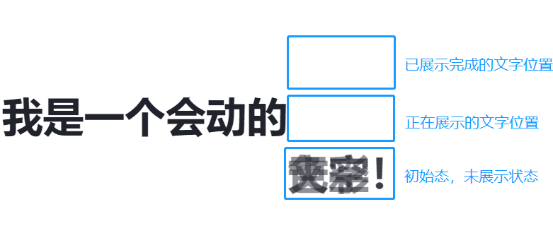
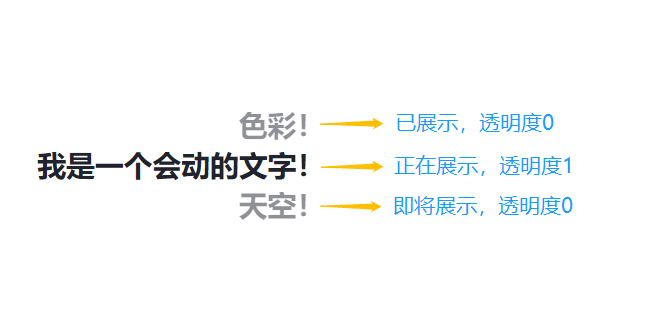
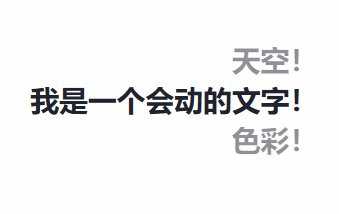
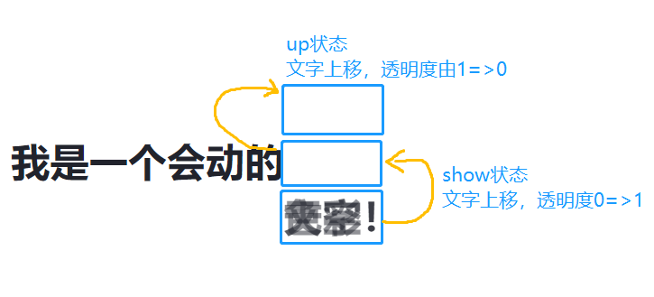
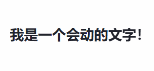
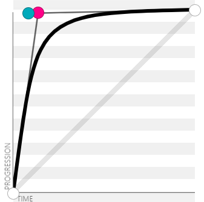

网站首页标题是映入访客眼中的第一道风景！通过它我们可以向用户传达想要一些关键内容。例如：
1. 功能性站点，可以宣传自己相比同类网站，提供了哪些独特的作用。
2. 产品官网，可以宣传自己产品的特点，功效。
3. 个人博客，可以传达博客更新内容和方向是什么。

通过标题，用户已经初步了解到网站的作用，能否吸引到用户收藏你的网址，更重要的则是网站内容能否抓住目标用户的需求。
回到主题，我们来看看今天要一个简单的标题轮播动画如何实现吧！

下面的示例就这篇文章将要实现的效果：

<Introduce 
  title="我是一个会动的"
  style={{padding: 0,fontSize: "calc(1.8rem)", marginBottom: 32}}
  labels={[
    {
      label:"天空！"
    },
    {
      label:"文字！"
    },
    {
      label:"色彩！"
    }
  ]}
/>

我很喜欢这个动画效果，有以下几个原因：
1. 对于第一眼看见的读者，会被动画轮播吸引，由于想知道下一轮关键词是什么，不觉间就会了然标题想传达的所有内容。
2. 对于我来讲，文案创作时，固定标题和变化轮播字的组合能让我感到快乐，不同的句式，词语组合所焕发的效果截然不同，也许这就是语言的魅力吧！
3. 这个动画是简单且易实现的，但是能够覆盖到到基本的动画知识！

这篇文章便是要以尽量简明的方式向读者传达如何实现这样文字轮播的效果！

## 使用到的技术栈

这里使用到react + style-components作为实现的主要技术栈，你可以照着我给出的代码逐步还原，实现同样的效果。
更重要的是理解如何实现轮播，以及动画的实现，即便切换到其他的技术栈，你也可以得心应手。

## 设计组件API

这里设定下组件名为`Introduce`，意为介绍标题。通过例子可以看到组件分为固定的主要标题部分，和变化轮播文字部分。
那么可以设计出组件最基本的api:

```javascript
<Introduce 
  title="我是一个会动的"  // 固定不变的主要标题部分
  labels={["天空！","文字！","色彩！"]}  // 可以传递任意数量的关键词
/>
```

## 基本样式的搭建

html基本结构不是这篇文章的主要内容，因此，我直接给出基本的结构和样式并作简短的注释。

```javascript
// 最外层容器
const IntroduceWrapper = styled.h1`
    padding: var(--font-size) 0;
    font-size: var(--font-size);
    color: var(--color-gray-1000);
    white-space: pre-wrap;
`;

// 轮播字显示区，用于控制轮播字布局
const Mask = styled.span`
    position: relative;   // 子元素相对于该元素进行定位
    display: inline-block;  
    vertical-align: top;
`;

// 轮播字
const LunboText = styled.span`
    display: inline-block;
    position: absolute;
    top: 0;
    left: 0;
    white-space: nowrap;  // 不允许轮播文字换行，否则将影响展示
    /* 关键代码，所有文字初始状态 */
    transform: translateY(100%);
    opacity: 0.5;
`;

const Introduce = ({
  title,
  labels,
  ...rest
})=>{
  return (
    <IntroduceWrapper  {...rest} >
        {title}
        <Mask>
            {labels && labels.map((label, i) => <LunboText key={i}>{label}</LunboText>)}
        </Mask>
    </IntroduceWrapper>
  )
}
```
上面的结构搭和基本样式做好之后，可以得到下面的效果，所有轮播字位于我们预设状态(未展示状态)，图中同样表示了所有可能出现的状态，如下：



**当下所有轮播字都叠在一起，不便于观察，我们给轮播字添加些许样式，来展示在轮播过程中，轮播字每种状态对应的样式。
我们先假定第1和第3个轮播字分别为即将展示和已展示完成的状态，而第2个轮播字则正在展示，无需做样式调整。**

首先我们在jsx中定义，up参数代表已展示项,show则表示当前展示项

```javascript
<Mask>
    {labels && labels.map((label, i) => <LunboText 
        key={i} 
        /* 关键代码 */ 
        up={2 === i} // 已展示
        show={1 === i}  // 当前展示项
        /* 关键代码 */ 
      >
        {label}
      </LunboText>)}
</Mask>
```
定义好了styled-components组件的参数，接下来便可根据参数定义具体的样式：

```javascript
const LunboText = styled.span`
    // ...省略上面出现过的代码

    // 根据styled-components组件状态参数得到对应的样式
    ${({ show, up }) => {
        // 正在展示的文字状态，透明度为1
        if (show) {
            return css`
                transform: translateY(0%);
                opacity: 1;
            `;
        }

        if (up) {
            // 展示过的文字状态，文字位于当前展示文字上方，透明度为0
            return css`
                transform: translateY(-100%);
                opacity: .5;
            `;
        }
    }};
`
```

下图中，已展示和未展示的文字透明度应当为0，为了便于理解，暂时这两种状态的透明度设定为0.5。



定义好轮播中3种状态的样式，接下来我们便可以**使用js来控制文字轮播状态切换逻辑，
便可以实现基本的轮播效果**，最后我们在添加轮播中的动画效果即可。

## 轮播的逻辑

轮播的逻辑就是定时切换轮播字的状态，因此我们需要一个定时器执行轮播逻辑。

同时使用两个变量用于保存当前展示文字和已展示文字的索引。同时将前面LunboText样式组件参数使用变量进行替换

```javascript
// 当前展示的文字索引，默认第一个元素
const [showIndex, setShowIndex] = useState(0);

// 当前已展示过的文字索引
const [upIndex, setUpIndex] = useState();

// 在Introduce组件加载时就设定好定时器执行轮播逻辑，时间间隔为3s
useEffect(() => {
    let timer = setInterval(() => {
      // to do...
    }, 3000)
    return () => {
        clearInterval(timer)
    }
}, [])

// jsx
<Mask>
    {labels && labels.map((label, i) => <LunboText 
        key={i} 
        /* 关键代码 */ 
        up={upIndex === i} // 已展示
        show={showIndex === i}  // 当前展示项
        /* 关键代码 */ 
      >
        {label}
      </LunboText>)}
</Mask>
```

接下来便需要思考定时器中轮播切换的具体逻辑。我们只需要分别思考上面提到的3种状态的文字如何进行切换：
1. 对于即将展示的文字，应将其状态切换为正在展示，即将其索引保存至showIndex变量。
2. 对于当前正在展示的文字，应将其切换为up状态，即索引保存至upIndex变量。
3. 对于已经展示状态的文字，则应切换为初始态。回到展示文字的下方。


```javascript
setInterval(() => {
    // 当前应该上去的元素
    let upIndex = showIndex;
    // 当前应该展示的元素,如果当前展示的元素是labels数组最后一位，则当前展示索引应该回到第一位
    let curIndex = showIndex + 1 >= labels.length ? 0 : showIndex + 1;
    // 当前应该下去的元素
    setShowIndex(curIndex);
    setUpIndex(upIndex);
}, 3000)
```

做好了上面的逻辑设定，我们便已经完成了轮播的功能。



## 关键帧设计

经过上面的步骤，我们设定好了不同状态的样式，以及轮播切换的逻辑。
接下来我们只需要定义不同状态下需要执行的动画即可。



那我们们分别定义show状态的动画名位fadeIn,意为淡入。up状态的动画名为fadeOut，意为淡出。
styled-components的动画定义方式如下，除了动画名定义写法不同，关键帧的定义则完全一样。

```javascript
const fadeIn = keyframes`
    from{
      opacity:0;
      transform:translateY(100%)
    }
    to{
      opacity:1;
      transform:translateY(0)
    }
`;

const fadeOut = keyframes`
    from{
      opacity:1;
      transform:translateY(0)
    }
    to{
      opacity:0;
      transform:translateY(-100%)
    }
`;
```

定义好动画之后，我们需要将LunboText组件下的up，show状态下的样式替换为我们定义的动画即可。

```javascript
${({ show, up }) => {
    if (show) {
        return css`
            animation: ${fadeIn} 400ms forwards;
        `;
    }
    if (up) {
        return css`
            animation: ${fadeOut} 250ms forwards;
        `;
    }
}};
```
为了使得动画结束后，保持最后一帧的状态，我们需要将animation-fill-mode设定为forwards。
至于动画时长和贝塞尔曲线，都可以根据自己的喜好进行设定。看看效果吧~



## 细节优化

轮播动画已经完成啦。接下来针对几个小细节进行优化。

### 渐变色轮播字

给轮播字添加渐变色背景，使得其更加突出显眼，得到吸引人的目的。分享
一个渐变色网站[webgradients](https://webgradients.com/)。个人使用下来觉得有以下优点：
1. 颜色清新，不存在直男配色。
2. 可以直接复制css，使用方便。

颜色有了，我们接下来对LunboText组件样式进行调整。

```css
const LunboText = styled.span`
    // 省略重复代码...
    background-size: 100% 100%;
    background-repeat: no-repeat;
    background-clip: text;
    -webkit-background-clip: text;
    color: transparent;
`
```

**组件轮播字数组项参数格式变更,添加backgroundImage参数用于用户传参**，为了使得类型表述更清晰，
下面的代码使用了ts的写法：

```typescript
// 变更前
type label = string;

// 变更后
type label = {
  label: string
  backgroundImage: CSSStyleSheet
}
```

使用backgroundImage参数

```javascript
let DEFAULT_IMAGE = "linear-gradient(to right, #4facfe 0%, #00f2fe 100%)";

<Mask>
    {labels && labels.map(({ backgroundImage = DEFAULT_IMAGE, label }, i) => <LunboText key={i} delay={delay} show={showIndex === i} up={upIndex === i} style={{ "--color-start": i, "--color-end": i + 1, backgroundImage }} >{label}</LunboText>)}
</Mask>
```

看一下效果：

<Introduce 
  title="我是一个会动的"
  style={{padding: 0,fontSize: "calc(1.8rem)", marginBottom: 32}}
  labels={[
    {
      label:"天空！"
    },
    {
      label:"文字！"
    },
    {
      label:"色彩！"
    }
  ]}
/>

对轮播字的颜色和突出展示优化之后，看看动画的优化吧！

### 动画延时+贝塞尔函数

**轮播字show状态和up状态的动画几乎是同时执行的，看起来比较着急，用户注意力也无法完全集中于要展示的文字。
对up状态下的动画添加延时参数，达到适当留白的目的，使得动画更加自然和谐**。
仿佛排队一样，前面的人进一步，后面的人不会紧紧跟随，
而是等前面的空位留出来后再继续前进，免得太着急踩到别人的鞋子。

贝塞尔曲线在css动画种用于控制动画执行过程的速度。这里分享一个[在线贝塞尔曲线网站](https://cubic-bezier.com)。
为了使得排队的效果更加明显，通过贝塞尔曲线控制我们的轮播动画先快后面，好比排队时，前面留出空位了，
后面的人会立马跟上占住空位，占到空位之后动作便会放松变慢。

我通过在线网站得到了如下的曲线和参数cubic-bezier(.14,.98,.08,.98)：



最终我们的代码调整为：

```javascript
if (show) {
    return css`
        animation: ${fadeIn} 400ms cubic-bezier(.14,.98,.08,.98) forwards;
        animation-delay: 250ms;
    `;
}
```

未添加延时参数：

<Introduce 
  title="我是一个会动的"
  style={{padding: 0,fontSize: "calc(1.8rem)", marginBottom: 32}}
  delay={false}
  labels={[
    {
      label:"天空！"
    },
    {
      label:"文字！"
    },
    {
      label:"色彩！"
    }
  ]}
/>

添加演示参数+贝塞尔曲线：

<Introduce 
  title="我是一个会动的"
  style={{padding: 0,fontSize: "calc(1.8rem)", marginBottom: 32}}
  labels={[
    {
      label:"天空！"
    },
    {
      label:"文字！"
    },
    {
      label:"色彩！"
    }
  ]}
/>

## 大功告成

经过轮播字颜色+动画效果的优化，我们的轮播动画体验已经足够舒服。至此我们已经完成了Introduce组件！
你可以在我的[首页](/)和[日志](/logs)见到Introduce组件的身影！

轮播功能比较通用常见的需求，我在此篇文章种分享的内容，属于比较基础的功能实现。
后续我的博客也将会产生图片轮播的需求，而Introduce组件则完全不适用于这样的需求，
但本质上他们都属于轮播功能，一些共通之初也是可以进行抽象复用的，
届时我再根据自己的需求，做出一套更加通用的方案，敬请期待！