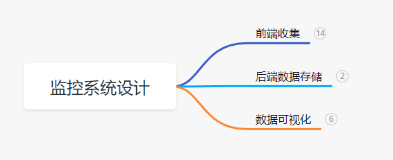
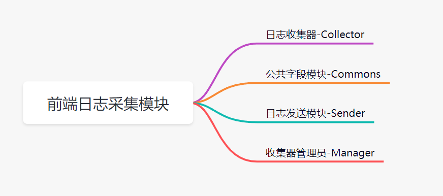
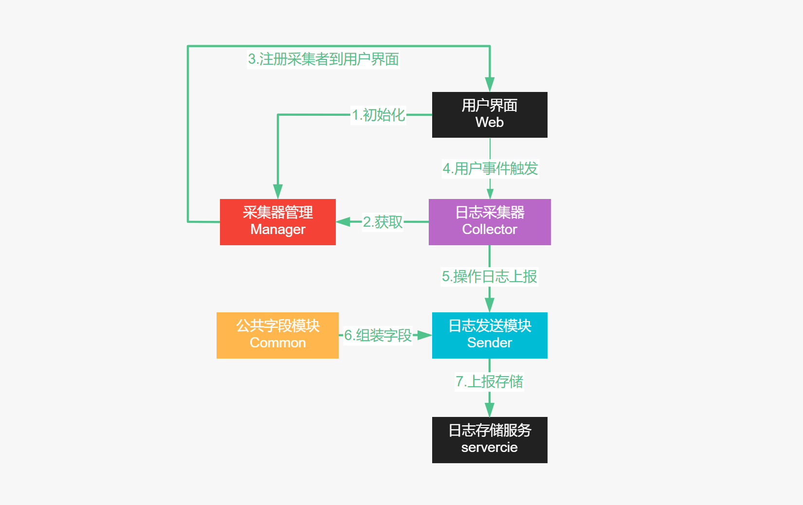

最近因为比较忙，无暇顾及博客更新，一方面在学习摄影。另一方面则是在研究网站的日志系统。

日志系统是一个app的组成部分。日志使得我对博客整体运行情况了如指掌。

那么，常见的监控系统主要由3部分组成：

1. 前端收集: 日志数据源头在前端，我们通过日志采集模块讲这些数据进行收集并上报。
2. 后端数据存储：主要负责接受前端上报的数据，并采用合理的方式进行存储。
3. 数据可视化：将存储的大量日志，通过聚合分组排序等手段得到期望的指标，前端使用可视化技术展示。



本文主要从前端说起，讲的是我的前端日志收集模块的设计与实现。

## 技术栈与模块结构设计

模块的主要技术栈是TS+ES6对象，采用面向对象的思想进行设计。前端日志采集方式主要分为两类：

1. 事件型。常见的事件有click(用户点击)，load(用户进入页面)，scroll(用户滑动页面)。
我们在关注的事件上注册相应的日志收集方法，就可以完成相应信息收集。
2. 重写型。本身没有提供事件监听，只能重写原方法，添加日志收集的功能。例如重写fetch，可以实现前端接口调用监听。

本模块将事件监听的方式完成上述两种类型采集，重写型由于没有提供事件监听功能，因此我们需要手动实现添加事件监听的功能。
具体实现可参看后文【[fetch添加事件发布功能](#fetch添加事件发布功能)】。基于事件监听模式，将日志采集模块分为四个部分：



- 日志采集器-Collector：主要采集各类事件的`event`对象，处理后将数据上送给`日志发送模块Sender`。 
- 公共字段模块-Commons：统一管理所有日志中都需要包含的信息，主要是UA，本地缓存的userId, TraceID(链路id，串联用户一次完成的访问记录), 日志时间等。
- 日志发送模块-Sender：接收到采集器上送数据后，从`Commons模块`获取公共字段，组装后，通过合理的方式将数据进行上报给后端服务。
- 采集器管理员-Manager：`Manager模块`负责所有采集者的注册或者注入，新增。统一管理所有的采集器。

Collector模块是其中最重要的概念，它可以完成任何事件的注册和信息采集，无论是dom事件或者被重写的方法，
只要被采集对象拥有事件订阅功能。有了这个概念，我们可以实现拓展能力非常强大的日志采集模块。

先来通过下图看下整个模块如何工作：



用户进入页面后，`采集者管理员`将所有的`日志采集者`注册到`用户界面上`，用户触发事件后，
相应的`日志采集者`将对日志进行处理后上送给`日志发送模块`，发送模块获取公共字段后将日志进行组装，
并上报给`存储服务`。

## 日志的上报方式

在正式开始编写模块时，先了解日志上报的常见方式，各有优缺：

- fetch/xhr：最常见的上报方式，可能遇到跨域问题。页面卸载时，采用异步上报可能导致数据丢失，同步上报将阻塞浏览器的关闭，导致页面卡顿。

- img：简单且，不会遇到跨域问题。退出页面的日志可能上报失败，数据丢失。

- sendBeacon：该api保证页面完全卸载前将数据上报，无数据丢失风险。兼容性：除了IE，其余浏览器都广泛支持。

本模块主要采用了img和sendBeacon两种上报方式：

```typescript
// 图片上报
const sendImage = (url:string, data:any)=>{
    let image = new Image();
    image.src = url + "/" + encodeURIComponent(JSON.stringify(data)); 
    image.onerror = ()=>{
        image = null;
    }
}

// sendBecaon上报
const beacon = (url:string,data: any)=>{
    if (!navigator?.sendBeacon) {
        throw "current env don't support sendBeacon!"
    }
    navigator.sendBeacon(url, encodeURIComponent(JSON.stringify(data)))
}
```

注意两种上报方式对应了不同的请求方式。其中图片上报为GET请求，而sendBecaon将发起POST请求，因此，服务端需要提供两种上报途径。

## 模块入口文件

我们首先编写好日志采集模块的入口文件，就好写文章先拟好大纲一样。入口文件主要暴露init函数，
供使用方调用完成模块的初始化工作：

1. 初始化公共字段模块Commons
2. 初始化发送器Sender
3. 重写各类方法，例如fetch
4. 注册所有的采集者

```typescript
// 导入公共字段模块
import Common from "src/common";
// 导入所有的采集者
import collectors from "./collector";
// 导入重写方法
import { rewriteFetch } from "./collector/fetch";

/**
 * 初始化方法暴露url参数供用户定制日志上报地址。
 * 1. 初始化公共字段模块Commons
 * 2. 初始化发送器Sender
 * 3. 重写各类方法，例如fetch
 * 4. 注册所有的采集者
*/
const init = ({
    url
}:InitProps):void=>{
    // 获取Common模块实例
    const common = Common.getInstance();
    // 初始化sender
    const sender = new Sender(url, Common);
    // 组装所有重写方法
    const writers = [ rewriteFetch ]
    // 管理员接受收集者并注册，同时将采集者和sender关联
    const manager = new Manager(collectors, sender, writers);
}

export default {
    init
}
```

我们已经按照工作流程图将入口文件的代码完成，接下来是分别实现每个模块的代码。

## Manager模块

管理员重写所有需要重写的方法，注册所有采集者，同时将采集者和sender关联。

```typescript
new Manager(collectors, sender, writers);
```
Manager调用Collector的listen完成事件注册, 
同时对listen方法传入Sender日志采集完成后进行上报。

```typescript
class Manager {
    constructor(loggers: Collector[], sender: sender, writers: Function[]) {
        this.loggers = loggers;
        this.sender = sender;
        this.init()
    }

    /**
     * 初始化注册所有日志收集器
     */
    init() { 
        // 重写各类方法
        writers.forEach(write=>writer())
        // 注册所有的Collector对象
        this.registerLoggers() 
    }

    /**
     * 注册事件
     */
    registerLoggers() { this.loggers.forEach((logger: Collector) => logger.listen(this.sender))}
}

export default Manager;
```

## Collector模块

一个Collector对象负责一类事件的采集，并且实现listen方法，供manager在初始化时调用完成事件注册。

### Collector的结构

listen方法主要完成事件的订阅，事件订阅的常见形式为：
```typescript
window.addEventListener("click", listener);
```
这段代码可以拆分成3个变量来描述：
1. `ListenerTarget`, 监听目标的方法，对应window.addEventListener
2. `type`, 对应"click" ，代表监听的事件类型
3. `listener`, 在本模块中，代表采集事件信息的函数，处理event对象，并返回处理好的object对象。

上面的3个参数被作为Collector对象的construtor参数。先初步完成Collector的结构：

```typescript
class Collector {
    private ListenerTarget:Function; // 监听目标
    private type:string;       // 监听事件类型
    private listener:Function;  // 采集者，负责收集用户事件信息
    constructor({ListenerTarget, type, listener, sender}:{
        ListenerTarget?:Function, type: string, listener: Function, sender?: Function
    }){
        this.ListenerTarget = ListenerTarget;
        this.type = type;
        this.listener = listener;
    }

    /**
     * 在监听目标上注册对应类型的监听器
     */
     listen(){
        // 注册监听事件
        target(this.type, this.listener);
    }
}

export default Collector
```

有了liseten函数，Manger便可以调用Collector的listen函数完成事件注册。

这里是对前端最常见的订阅方法进行抽象。满足上述window.addEventListener形式的事件订阅，
都可以使用Collector完成事件上报！

例如，Next.js中路由切换事件的写法为:
```typescript
Router.events.on("routeChangeComplete", listener)
```
因此Collector本质是一个事件订阅器。

下面列出前端常见监听的事件

import Table from 'antd/lib/table'

<Table 
    columns={[
        {
            title: "监听对象",
            dataIndex: "target"
        },
        {
            title: "事件类型",
            dataIndex: "type"
        },
        {
            title: "作用",
            dataIndex: "use"
        }
    ]}
    pagination={false}
    dataSource={[
        {
            target: "window",
            type: "load",
            use: "用户进入页面"
        },
        {
            target: "window",
            type: "click",
            use: "追踪点击行为"
        },
        {
            target: "window",
            type: "scroll",
            use: "用户滑动屏幕"
        },
        {
            target: "window",
            type: "error",
            use: "用户界面报错"
        },
        {
            target: "window",
            type: "unhandleReject",
            use: "用户滑动屏幕"
        },
        {
            target: "window",
            type: "unhandledrejection",
            use: "Promise未捕获的错误，一般为异步请求中的错误"
        },
        {
            target: "window",
            type: "visibilitychange",
            use: "用户切换浏览器tab或退出页面"
        }
    ]}
/>


### 实现Collector的工作流程

以click事件的采集来阐述Collector的工作流程。

#### 事件处理

listener在事件触发的时候被调用，它负责处理事件的Event对象，并返回采集结果：

```typescript
const clicklistener = (e: Event)=>{
    const { target, type } = e;
    const { tagName, innerHTML, innerText } = target as HTMLElement;

    const info = {
        tagName,
        inner : innerHTML ||  innerText,
    }

    // 处理图片
    if ( tagName === "IMG" ) {
        info.src = (target as HTMLImageElement).src;
    }
    
    return {
        type,   // 事件类型
        target: info
    }
}

export default clicklistener的;
```

最终clicklistener采集了我所需的click事件的相关字段并返回，返回的结果如何处理呢？

#### 代理listener

在Collector对象的listen函数中，我们对listener进行代理，代理的作用是以获取日志采集结果，并上报给Sender！
其中Sender由Manager传入，是全局公用的上报器。

```typescript
    /**
     * 在监听目标上注册对应类型的监听器
     */
     listen(Sender: Sender){
        let target = this.ListenerTarget || window.addEventListener
        // 代理
        const proxyListener = (...args: any[]) => {
            // 获取日志处理函数返回的结果
            const result = this.listener.apply(this, args);
            // 如果返回false，则不发送日志
            if (!result) return;
            // 调用Sender方法上报日志
            Sender.add.call(Sender, this.type, result);
        }
        // 注册监听事件
        target(this.type, proxyListener);
    }
```

至此Collector的实现已经完成啦！我们可以通过Collector注册各类事件并完成日志的采集。

### fetch添加事件发布功能

诸如fetch这类方法，本身不提供事件监听功能，因此无法通过Collector采集日志。
因此需要自行实现事件发布订阅模块。
重写fetch时，通过事件模块发布相应的事件，供Collector注册日志采集者。

首先实现一个事件模块，供我们在重写的方法中发布事件。

```typescript
class event {
    private listners: {[key:string]: any[]};
    constructor(){
        this.listners = {};
    }

    // 订阅
    on(eventType:string, listner:Function){
        if (!this.listners[eventType]) {
            this.listners[eventType] = []
        }
        this.listners[eventType].push(listner)
    }

    // 发布
    emit(eventType:string,...args:any){
        if (this.listners[eventType]) {
            this.listners[eventType]?.forEach((listener)=>{
                listener(...args);
            })
        }
    }
}

export default new event();
```

有了事件发布订阅模块。为重写fetch为例，展示如何添加FETCHSUCCESS(请求成功) 和 FETCHERROR(请求失败)事件。

```typescript
import event from 'src/event/event'
import {LOG_TYPE} from '../typing'
let hasWrite = false
function rewriteFetch() {
    ((window) => {
        if (hasWrite) {
            return;
        }
        const oldFetch = window.fetch;
        window.fetch = function (input: RequestInfo | URL, init?: RequestInit): Promise<Response> {
            const startTime = Date.now()
            const data = {
                startTime,
                url: input,
                method: (init?.method || 'GET').toUpperCase(),
                endTime: Date.now(),
                duration: 0,
                status: 0,
                success: false
            }
            event.emit.call(event, LOG_TYPE.FETCHSTART, data)
            return oldFetch(input, init).then((res) => {
                data.endTime = Date.now()
                data.duration = data.endTime - data.startTime
    
                const data = res.clone()
                data.status = data.status
                data.success = data.ok
                event.emit.call(event, LOG_TYPE.FETCHSUCCESS, data)
                return res;
            }).catch(err => {
                data.endTime = Date.now()
                data.duration = data.endTime - data.startTime
                data.status = 0
                data.success = false
                event.emit.call(event, LOG_TYPE.FETCHERROR, data)
                throw err;
            })
        }
        hasWrite = true;
    })(window)
}

export {
    rewriteFetch
}
```

通过重写fetch，添加了请求成功和失败事件。这样就可以通过Collector注册fetch的请求成功事件，
以此完成日志的上报。

```typescript
new Collector({
    type: LOG_TYPE.FETCHSUCCESS,
    ListenerTarget: event.on.bind(event),
    listener: (data)=>{
        console.log("数据请求成功！");
        return data;
    }
})
```

对于任何需要重写的方法，我们都可以通过上面的事件模块去发布相应的事件。模块使用者可以自行决定是否要注册相应的事件。

## Sender模块实现

sender将接受所有采集上送的信息，并根据不同的类型将日志进行上报。
上报方式一共由两种：

1. sendeImg，通过图片上传，所有Collector对象的缺省值。
2. sendeBecaon，主要用于页面退出日志的上报。

Sender采用上面两种上报方式放在一个策略对象中，

collector在调用Sender上报日志时，据collector传入的策略，将数据进行上报！

```typescript
import Common from "src/common";
import sendImage from "src/utils/sendImg";
import { SENDER_TYPE } from "src/typing";
import beacon from "src/utils/sendBecaon";

class Sender {
    private common: Common;
    private url: string;
    constructor(url:string, common: Common) {
        this.url = url;
        this.common = common;
        this.strategy = {
            [SENDER_TYPE.IMG]: sendImage,
            [SENDER_TYPE.BECAON]: beacon
        }
    }

    /**
     * 添加消息
     * @param data 日志内容
     */
    add(type: SENDER, data: any) {
        const sendFn = this.strategy[type]
        if (!sendFn) {
            throw `no strategy for ${type} type！`
        }
        const logInfo = {
            ...data,
            ...this.common.getCommons() // 获取公共字段
        }
        // 上报日志
        sendFn(this.url, data);
    }
}

export default Sender;
```

除了Collector会进行日志上报外，模块使用者也可能手动上报一些日志，因此我还提供了custom方法。

```typescript
    /**
     * 手动上报日志，默认类型为custom
     */
    custom(info: Object, senderType: SENDER = SENDER_TYPE.IMG, type: string = "custom"){
        const data = {
            ...info,
            ...this.common.getCommons()  // 获取公共字段
        }
        this.add(senderType, data);
    }
```

每条日志上报服务端之前，都需要组装上公共字段，下面是公共字段模块的实现。

## Common模块实现

Common模块将记录以下信息：
1. userId(用户id)。本站没有用户系统，因此前端生成临时id作为唯一用户标识，并使用localstorange存储。
2. traceId(用户本次访问id)。串联用户从进入网站到退出浏览器这段时间内所有日志。为保障所有traceId一致，通过sessionStorange保存。
3. 用户ua信息。使用ua-parser-js进行解析读取。

最终通过`getCommons`方法返回所记录的所有公共字段。

```typescript
import User from 'src/user';
import UAParser from 'ua-parser-js'
import { v4 as uuidv4 } from 'uuid';
class Common {
    private user: string
    private ua: UAParser.IResult
    constructor(){
        this.ua = new UAParser().getResult(); // 记录用户的使用设备浏览器版本信息。
        this.user = new User(); // 记录用户id和traceId
    }

    getCommons(){
      return {
        // 返回所有的公用字段
      }
    }
}

export default Common;
```

### User模块

User模块主要用于生成和读取用户的临时id，traceId。看代码即可。

```typescript
class User {
    constructor(){
        // getLs是读取localstorange缓存的方法
        this.userId = getLs("userId");
        // getLs是读取sessionStorange缓存的方法
        this.traceID = getSs("traceId");
        // 生成用户id
        if (!this.userId) {
            this.userId = uuidv1();
            setLs("userId", this.userId)
        }
        // 生成traceId
        if (!this.traceId) {
            this.traceId = uuidv4();
            setSs("traceId", this.traceId)
        }
    }
}
```

公用模块的内容比较简单，已经全部完成！

## 优化一下

### 节流

利用collector，我们可以注册任何事件，如果注册mousemove这类事件，短时间产生大量日志，
轻则造成前端卡顿，重则服务器崩溃。因此我们需要对这类事件进行节流处理。

```typescript
import { throttle } from 'lodash'

const THROTTLE_EVENT = ["mousemove", "touchmove", "scroll"]
class Collector {
    listen(){
        // 关键代码
        let wait = 0;
        if (THROTTLE_EVENT.includes(this.type)) {
            wait = 1000;
        }
        const proxyListener = throttle(
            listener,
            wait
        )
    }
}
```

## 总结

本文主要基于事件发布订阅的机制实现一个高拓展性的日志上报模块。

轮子造好了，下一篇文章，我们看看页面的性能日志，行为日志，错误日志等前端常见日志时如何采集和处理的吧！
对源码感兴趣欢迎访问：[hui-weblog](https://gitee.com/codehunterwjh/hui-weblog.git)！