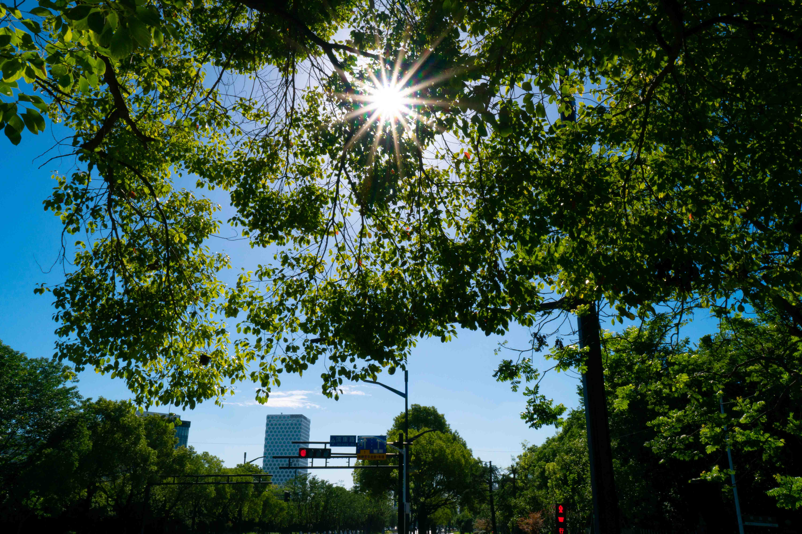
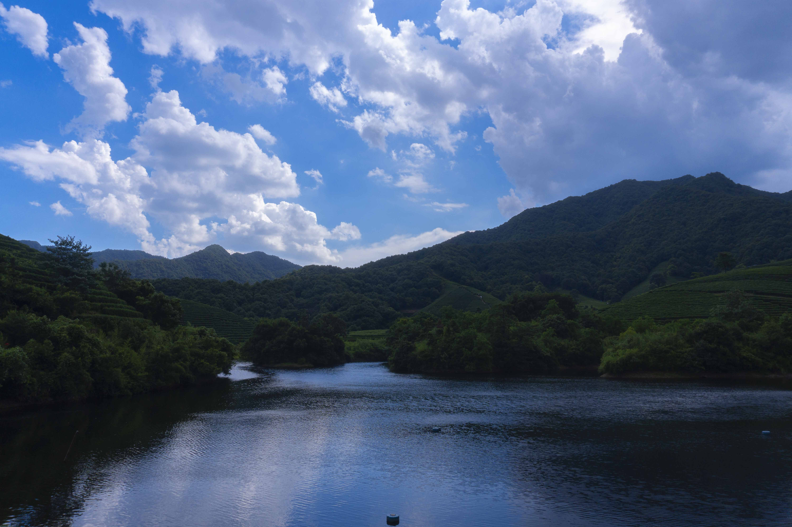
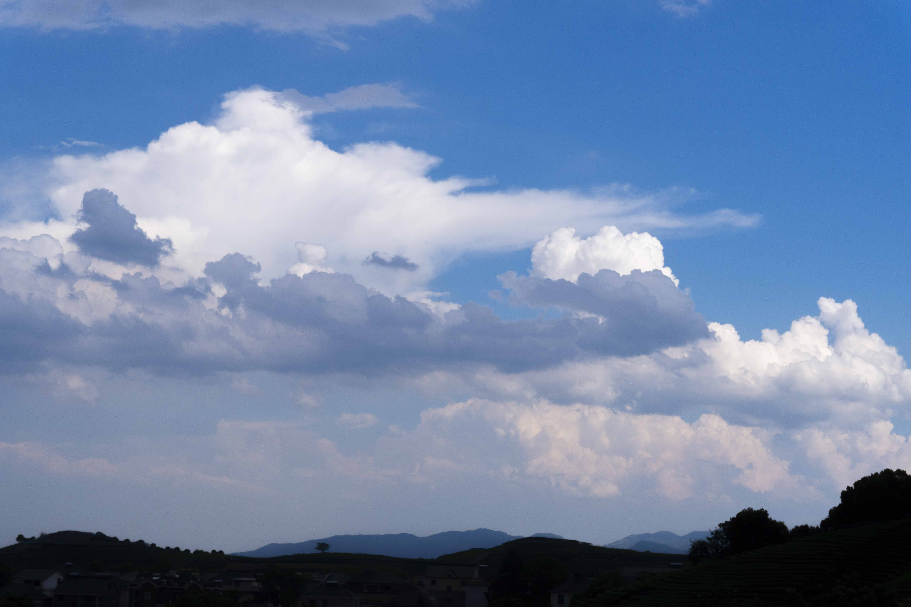
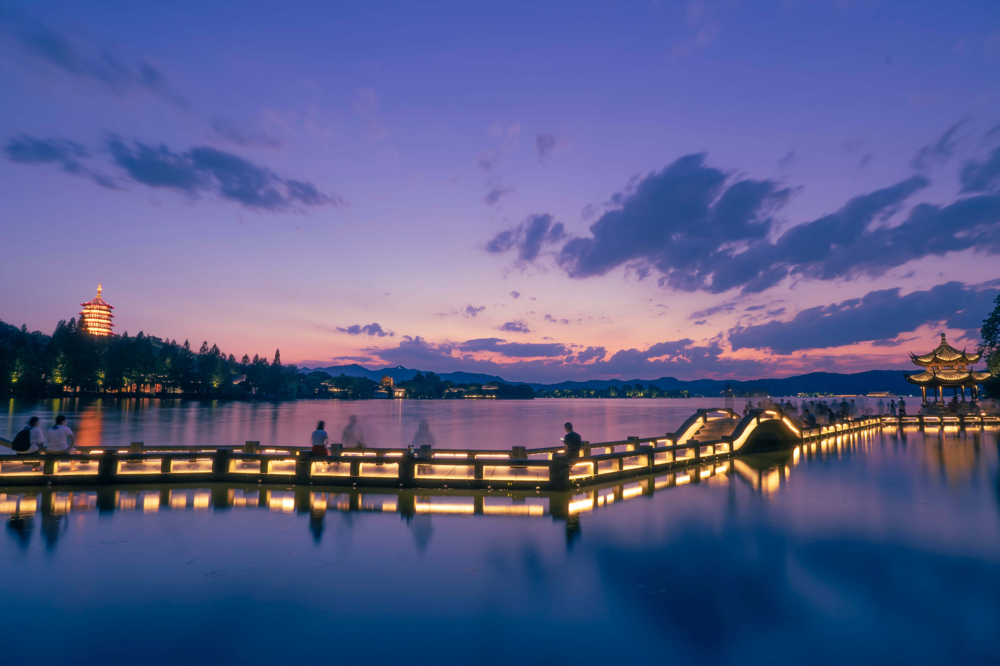

如果要问我拍照的乐趣是什么？其实这是我想过很多次的问题，大概每一次都会有不同的想法：我想可以用短暂的拍摄经历和几张照片来回答一下这个问题啦！

## 器材带来效果-星芒

使用相机拍摄有时能得到和肉眼不同的感受，对于太阳或者路灯，人看看到是一团光，而在透过相机去看，就能发现星芒的存在哦，这是一种新奇的体验！

## 记录-生活的瞬间

生活中有的瞬间也许再也不会出现了呢？在炎热的下午出门拍照，我发誓再也不敢了，差点中暑：

## 等待-慢门摄影的魅力

等待着漫长的拍摄过程，每一次出片都是未知的体验，时间赋予每一张慢门照片珍贵的价值，即便是废片也不气馁哈哈，因为下次拍完一定会更好！

## 感受到美是短暂珍贵的

天地万物，四季变更，昼夜轮转，风云变化，天时地利在变化，景色也随之变化，这一切看似漫长，但每一个美的瞬间都需要用心去感受和把握！

## 惊喜随时会出现

![复兴大桥[横]：第一次出门拍夜景，一路上走走停停来到了这座桥，本来目的地不是这里，没想到那天拍到最好看的照片是来自这座桥。摄影的乐趣就是，保持对这个世界的好奇，耐心等待，不断探索，说不定惊喜就在某处等着你去开启！这张照片也有星芒的效果嘻嘻，看桥上的路灯！](./assets/复兴大桥夜景.jpg)

## 后期的魔法

其实后期也是拍摄的乐趣之一，拍到是一张作品的开始，通常我还会适当的调色，来表达心中的画面或者感情。也许，就像画画一样吧，相机是画笔，PS是调色盘，就像画画一样快乐(我不会画画，所以只能拍照啦哈哈哈)！

给大家看下复兴大桥的原图先：

![复兴大桥[竖]：原图的颜色比较惨淡！不是我想表达的城市的赛博朋克的感觉！reverse](./assets/复兴大桥未后期.jpg)

调整后，这张照片整体以冷色的紫和洋红为主，同时将路灯调成暖暖的橘色来点缀画面，冷暖对比，使得画面更加有我想要的感觉！

![复兴大桥[竖]：我更喜欢这张竖屏的大桥，画面主题除了大桥，还有石头作为前景，江面就不再是空荡荡的感觉啦！想象一下，如果画面上方再多一轮圆月，众星拱月！可惜天时地利不允许我拍到这样的画面，这是遗憾之美！ reverse](./assets/复兴大桥夜景竖.jpg)

要我说拍摄的乐趣真正来源是拿相机的那个人吧，如果他永远保持对世界的好奇，能够像孩童一样去用心感受时间万物，我想乐趣便永远不会消散！

不禁感慨了一下哈哈，拍照的乐趣还有很多，等着我去探索和发现，敬请期待更多有趣的照片和故事吧！