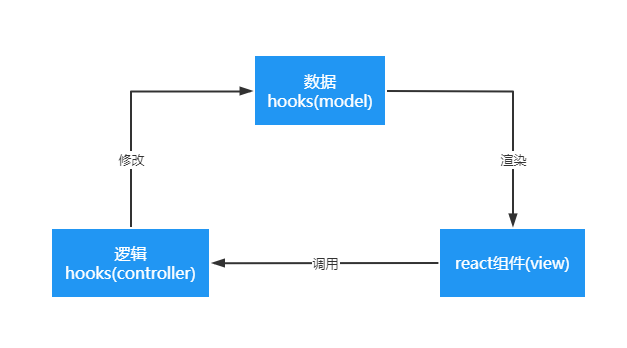

不知大家有没有遇到这样的问题，同样业务功能的应用，需要运行在多种设备上。
例如，pc端，pad端，手机端，ui设计师针对性设备的尺寸，交互特性不同，
会给出具备不同交互功能或样式的组件。如果是简单的样式和布局变化，我们可以考虑css媒体查询去做微调。
但复杂的样式交互变化，就有点为难css了。简单粗暴的解法就是，每端写一套代码，后果是，同样的逻辑代码写了好几次，
由此将巨大的维护成本，即便是简单的功能调整，
也需要将每端代码都进行同步调整。如果业务迭代复杂且频繁，过程必会痛苦不堪。

实际上，我们期望的形态是这样的：逻辑复用，ui分离。怎么做呢？

## 解耦逻辑与ui-前端mvc探索

mvc的思想在后端框架中比较常见，但在前端领域还没有过相关的探索。
随着hooks的出现，这一点出现了转变。当下，hooks主要分为两类：
1. 用于存储页面数据状态的hooks(简称为数据hooks)
2. 用于封装功能逻辑的hooks(简称为逻辑hooks)

要知道，hooks之间可以相互调用。这意味着，逻辑hooks可以轻易获取到数据hooks中的页面数据和状态。因此，
逻辑hooks可以很容易的操作应用数据，React作为声明式的ui框架，我们只需要操作数据，React将根据数据自动渲染页面。

有了上面的思路，前端层面的mvc模型也很容易实现，对应关系如下：

**数据hooks**=**model**, **逻辑hooks**=**controller**，**react组件**=**view**



基于数据驱动视图的思想，我们只需要将逻辑hooks和数据hooks分离到单独的package中即可。
不同端页面则根据设计，开发具有不同样式和交互的组件即可，组件只负责触发逻辑hooks和数据渲染。

## 复用逻辑-monorepo

monorepo只是代码仓库管理的一种形式，目的是将应用都放在同一个仓库中。与之相对的是multirepo(多代码库)，
一个应用对应一个仓库。multirepo的仓库模式中，为了完成代码的复用，只能通过npm包的形式。这样会带来一些问题：

1. 业务组件本身并不够通用，发布npm不算合适。
2. 本地开发，发布流程繁琐。

最大的问题在于第二点，本地开发需要link，而发布时，则需要先发npm包，业务组件才可以发布。等等，是不是忘改version了？
不好意思，重新发布一遍吧。更不要忘了，业务组件不可避免频繁迭代，这个过程无疑增加了开发人员心智负担。

monorepo则可以很好的解决上面的问题，monorepo本身不具备代码复用的能力，我们需要借助包管理工具才可以实现。
仓库的目录结构基本如下：

```bash
node_modules   / 项目依赖模块
  |__common    // 公用逻辑软链接
  |__pcui      // pc端ui软链接
  |__mobileui  // 移动端ui软链接
  |__...       // 其他依赖
packages
  |__common    // 公用逻辑
  |__pcui      // pc端ui，引用common，调用hooks获取逻辑和数据
  |__mobileui  // 移动端ui，引用common，调用hooks获取逻辑和数据
packages.json  // 项目配置
```

包管理工具帮助我们将`monorepo`仓库下`packages`中的依赖提升至根目录`node_modules`，
`packages`本身也会被软链接至根目录`node_modules`，得益于node模块索引机制，项目间可以方便的相互引用。

## 总结

hooks的出现让我们很方便完成逻辑复用和状态存储，结合monorepo，业务逻辑在多端不同ui的情况下，也可以方便的复用。