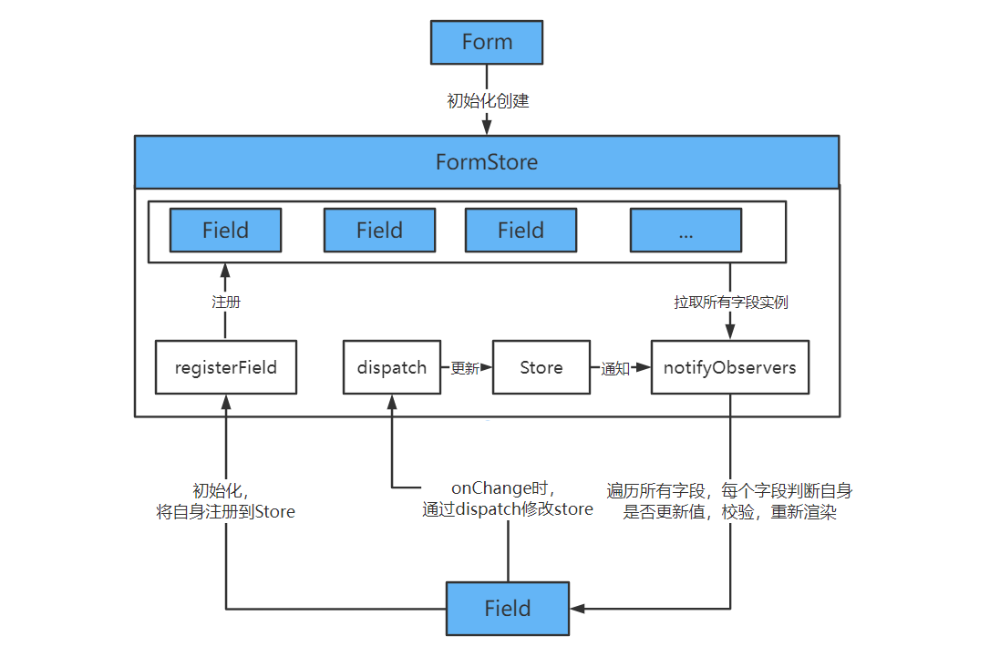
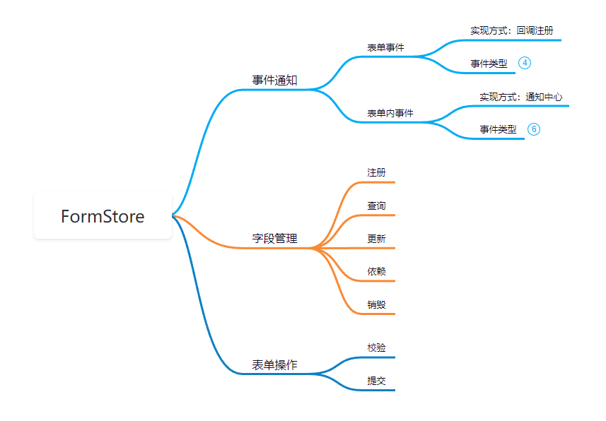
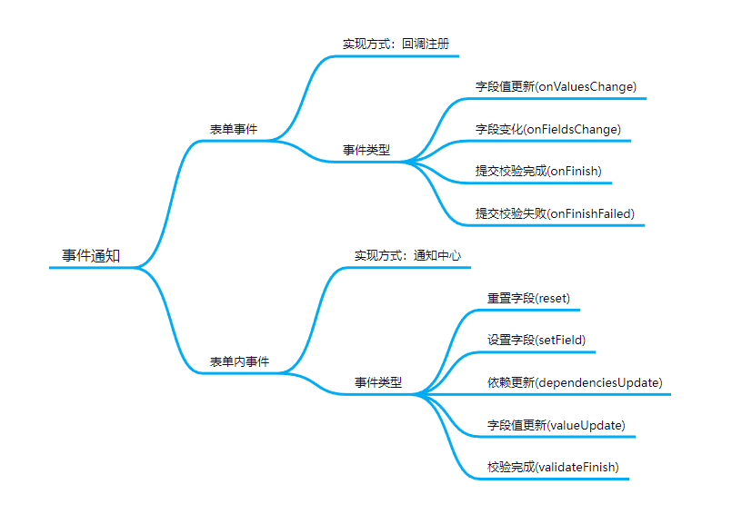

## 背景

在中后台应用中，表单在 B 端系统开发中发挥支撑作用，我常用的表单组件是 antd-form，相比直接使用 state 管理表单数据，
它提供了更加优雅的数据管理，字段校验，联动控制方式，极大提升生产力。我们熟知的`antd-form`内部
基于`rc-field-form`做了二次封装，因此，想要窥探优秀表单是如何设计和实现的，剖析`rc-field-form`源码，必不可少。

## package.json 总览

上手前，阅读 package.json 可以对项目的技术栈，工作流，模块标准，有整体的认知。

**files**

files 规定项目作为依赖被安装时包含的文件，它们分别对应项目所支持的一些模块形式。

```json
"files": [
  "lib",   // commonjs标准
  "es",    // es6模块标准
  "dist"   // umd模块标准
]
```

**main 和 module**

main 指定模块的默认加载入口文件，结合上面的字段，可以看到模块被引用时默认加载的 commonjs 标准的模块文件。
module 指定模块的 es6 模块标准下的入口文件，同样可以与 files 中的文件对应

```json
"main": "./lib/index"
"module": "./es/index"
```

**scripts**

通过 scripts 可以直观的看到组件使用 father 作为组件库的开发打包工具，storybook 作为文档生成工具，eslint 完成代码格式检查，np 完成组件库发布。

```json
  "scripts": {
    // 本地开发时运行的脚本，使用storybook作为文档工具
    "start": "father doc dev --storybook",
    // 生产构建storybook文档静态资源
    "build": "father doc build --storybook",
    // 组件库源码打包命令，使用father脚手架作为打包工具
    "compile": "father build",
    // 打包并发布，使用np作为发布工具
    "prepublishOnly": "npm run compile && np --no-cleanup --yolo --no-publish",
    // lint命令，检查ts.tsx文件的格式
    "lint": "eslint src/ --ext .tsx,.ts",
    // 使用father提供的测试功能进行组件测试
    "test": "father test",
    // 不知为何需要这条命令？？
    "now-build": "npm run build"
  }
```

**dependencies 和 peerDependencies**

`peerDependencies`指定父环境依赖，本项目只能在 React 环境下使用。
`dependencies`指定生产构建的实际依赖，可以看到项目使用 async-validator 来完成表单校验，具体用法等会细看源码。
`devDependencies`指定了本地开发环境下依赖，主要使用 ts 开发，father 作为组件库开发工具，enzyme 完成测试工作。

```json
"dependencies": {
  "@babel/runtime": "^7.8.4",
  "async-validator": "^3.0.3",
  "rc-util": "^5.0.0"
},
"peerDependencies": {
  "react": "*"
},
"devDependencies": {
  // 省略非核心依赖...
  "enzyme": "^3.1.0",
  "father": "^2.13.6",
  "np": "^5.0.3",
  "typescript": "^3.5.2"
  // 省略非核心依赖...
}
```

## 源码结构及工作原理

`rc-field-form`源码结构较为简单，基本是平铺的，src 目录下的文件如下，已大致标注模块的作用：

```bash
│  Field.tsx        // 表单字段管理组件
│  FieldContext.ts  // 字段上下文
│  Form.tsx         // 表单组件
│  FormContext.tsx  // 全局的表单控制，用于完成表单之间的联动
│  index.tsx        // 模块整体导出文件
│  interface.ts     // 类型定义文件
│  List.tsx         // 数组型字段管理
│  useForm.ts       // 创建FormStore的hooks
└─utils             // 工具方法文件夹(校验工具，数据格式)
```

其中核心的组件为：

1. useForm.ts 主要用于创建 FormStore
2. Form.tsx 表单外层组件，使用 Provider 全局共享 FormStore
3. Field.tsx 字段组件(对应 antd 的 Form.Item)，管理单个输入控件。初始化时接入 FormStore 进行管理。
4. List.tsx 对数组类字段提供更友好的管理 api

为了方便理解，后文中都会如下简称，映射关系已标注：

- Store = FormStore
- 表单 = Form
- 字段 = Field
- 数组字段 = List

**useForm**

表单的核心在于`useForm.ts`文件中的**FormStore 对象**(简称为 Store)，其接管表单的全部数据，并提供 api 用于完成表单操作。

**无论是表单内部的数据管理，还是使用表单的开发者，都只能唯一使用 Store 提供的 api 完成对表单的所有操作。理解后即可掌握表单对外提供的能力和内部数据管理方式。**

对开发者提供的 api，覆盖增查改，校验提交，这里不做详细介绍。主要介绍控制表单内部的状态管理和数据流动的 api，包括：

1. dispatch: 供表单字段对 Store 进行数据更新或校验
2. registerField: 供表单字段初始化时注册到全局 Store 中进行统一管理
3. useSubscribe: 处理 Form 的 children 为函数的情况，强制全局更新
4. setInitialValues: 设置初始值
5. setCallbacks: 供表单注册回调，例如 onValuesChange， onFieldsChange，onFinish 等
6. setValidateMessages: 设置校验模板
7. getFields: 获取表单字段
8. setPreserve: 设置当字段被删除时是否保留字段值

对表单内部 api 有大致解后，FormStore，Form，Field 三个核心组件的数据交互如下：



**表单初始化时，创建全局的 Store，并将该 Store 使用 React.Context 共享到全局，这样所有子组件可以轻松访问到 Store 提供的 api，
每个字段(类组件编写)初始化时，会将自身注册到 Store 中。字段 onChange 时，子组件通过 Store 提供的 dispatch，
将 value 提交到 Store 中，提交完成后，触发 Store 的通知机制，需要注意的是，通知时，Store 会遍历所有注册的字段，
但每个字段实例根据通知的信息，做出 render，校验等操作。**

**可以注意到，Store 的变化不会引起所有字段的重新渲染，由此保证了表单的性能。**

表单运行原理了解后，便可以阅读源码。

## 核心概念

源码中有几个比较重要的概念即类型定义，这些类型定义通常贯穿在整个源码中，理解他们是第一步。

### namepath-字段索引

```typescript
export type InternalNamePath = (string | number)[];
type NamePath = string | number | InternalNamePath;
```

namepath 相当与表单字段的唯一索引，通过数组的形式表示其在表单 store 数据对象中的位置。使用例子就很容易理解，
表单数据如下：

```typescript
{
  user: [
    {
      name: "张三",
      age: 1
    }
  ],
  type: "示例"
}
```

通过`["user", 0 , "name"]`这个 namepath，就可以从 Store0 获取到`张三`。

由于源码中会将 string 和 number 类型的值转化为数组格式(例如："name" => ["name"])，
因此可以简化为下面的定义来理解：

```typescript
type NamePath = (string | number)[];
```

### FieldData-字段数据

表单内部对一个字段定义了如下属性，并不止包含常规理解下的 name 和 value：

```typescript
interface FieldData {
  touched: boolean; // 是否被用户操作过
  validating: boolean; // 是否正在校验
  errors: string[]; // 错误信息
  name: NamePath; // 字段索引
  value: StoreValue; // 字段对应值
}
```

常规开发者只需关心 errors，name，value 这几个字段。例如 antd-form 根据 errors 开发了错误信息提示功能。

## 核心功能

### 数据管理-FormStore

FormStore 中封装了表单所有操作的核心逻辑。接下来分为几个模块进行叙述。



#### 字段生命周期管理

表单内接管表单内每个字段完整的生命周期。为了便于理解，
我将源码中的方法进行精简，主要逻辑转成注释，完整源码可以自行参看仓库。

1. 初始化，字段将自身注册到 Store，返回一个注销函数，供字段在 didmount 生命周期中注销字段。
2. 字段值更新时，表单字段 onchange 首先更新 store 中的值，store 在通知字段自身进行更新，并通知依赖字段更新。
3. 字段销毁时，调用字段注册时返回的注销函数，将自身在 store 中进行销毁。

主要代码如下：

```typescript
  /**
   * 字段注册时
   */
  private registerField = (entity: FieldEntity) => {
    // 将字段实例保存至store中
    this.fieldEntities.push(entity);

    // 初始值设置

    // 注册时，返回回调函数，供字段在didmout时调用
    return (preserve?: boolean) => {
      // 在store中注销字段
    };
  };

  /**
   * 字段值更新
   */
  private updateValue = (name: NamePath, value: StoreValue) => {
    // 更新store中的值
    this.store = setValue(this.store, namePath, value);

    // 通知字段进行更新
    this.notifyObservers(prevStore, [namePath], {
      type: 'valueUpdate',
      source: 'internal',
    });

    // 通知依赖的字段更新
    this.notifyObservers(prevStore, childrenFields, {
      type: 'dependenciesUpdate',
      relatedFields: [namePath, ...childrenFields],
    });

    // 调用开发者在表单中注册的onFieldsChange事件没
  };
```

#### 表单操作

表单的操作主要分为校验和提交。其中提交包含校验+表单值抛出。

表单校验实现：

需要说明，表单使用`async-validator`进行校验，其返回结果为 promise。

```typescript
  // =========================== Validate ===========================
  private validateFields: InternalValidateFields = (
    nameList?: NamePath[],
    options?: ValidateOptions,
  ) => {
    // 获取需要校验的字段
    const provideNameList = !!nameList;
    const namePathList: InternalNamePath[] | undefined = provideNameList
      ? nameList.map(getNamePath)
      : [];

    // 创建列表，用于收集字段的校验结果promise
    const promiseList: Promise<{
      name: InternalNamePath;
      errors: string[];
    }>[] = [];

    // 收集字段的校验结果promise
    this.getFieldEntities(true).forEach((field: FieldEntity) => {
      // ...
    });

    const summaryPromise = allPromiseFinish(promiseList);
    this.lastValidatePromise = summaryPromise;

    // 字段校验完成后通知相应的回调函数
    summaryPromise
      .catch(results => results)
      .then((results: FieldError[]) => {
        // 调用开发者注册的onFieldsChang事件
        this.triggerOnFieldsChange(resultNamePathList, results);
    });

    // 处理校验结果和错误信息
    const returnPromise: Promise<Store | ValidateErrorEntity | string[]> = summaryPromise
      .then(
        (): Promise<Store | string[]> => {
          if (this.lastValidatePromise === summaryPromise) {
            return Promise.resolve(this.getFieldsValue(namePathList));
          }
          return Promise.reject<string[]>([]);
        },
      )
      .catch((results: { name: InternalNamePath; errors: string[] }[]) => {
        // 处理错误信息
        return Promise.reject({
          values: this.getFieldsValue(namePathList),
          errorFields: errorList,
          outOfDate: this.lastValidatePromise !== summaryPromise,
        });
      });

    // 为了避免错误出现在控制台，对错误进行捕获
    returnPromise.catch<ValidateErrorEntity>(e => e);

    // 返回最终校验结果promise
    return returnPromise as Promise<Store>;
  };
```

表单的提交比较简单，主要首先待用上述校验方法，校验通过后，调用开发者注册的`onFinish`回调。否则调用`onFinishFailed`回调。

```typescript
private submit = () => {
    this.warningUnhooked();

    this.validateFields()
      .then(values => {
        const { onFinish } = this.callbacks;
        if (onFinish) {
          try {
            onFinish(values);
          } catch (err) {
            // Should print error if user `onFinish` callback failed
            console.error(err);
          }
        }
      })
      .catch(e => {
        const { onFinishFailed } = this.callbacks;
        if (onFinishFailed) {
          onFinishFailed(e);
        }
      });
  };
```

#### 事件通知

表单的事件分为内部事件和外部事件，外部事件用于开发者注册，内部事件用于`Store`管理表单内字段。



表单外采用事件发布订阅模式。表单初始化时，将开发者注册的回调函数保存在 Store 中，供 Store 在适时调用(即发布)。

例如，表单提交时，如果字段校验成功，Store 将调用开发者注册的`onFinish`事件，否则就会调用`onFinishFailed`事件。

```typescript
class FormStore {
  // 注册回调
  private setCallbacks = (callbacks: Callbacks) => {
    this.callbacks = callbacks;
  };

  // 提交时调用回调
  private submit = () => {
    this.validateFields()
      .then((values) => {
        const { onFinish } = this.callbacks;
        if (onFinish) {
          try {
            onFinish(values);
          } catch (err) {
            // Should print error if user `onFinish` callback failed
            console.error(err);
          }
        }
      })
      .catch((e) => {
        const { onFinishFailed } = this.callbacks;
        if (onFinishFailed) {
          onFinishFailed(e);
        }
      });
  };
}

// 回调类型
export interface Callbacks<Values = any> {
  onValuesChange?: (changedValues: any, values: Values) => void;
  onFieldsChange?: (changedFields: FieldData[], allFields: FieldData[]) => void;
  onFinish?: (values: Values) => void;
  onFinishFailed?: (errorInfo: ValidateErrorEntity<Values>) => void;
}
```

列举表单事件触发的时机：

1. onValuesChange：表单中任意字段的值发生变化时，只有 field 组件 onchange 时触发。
2. onFieldsChange: 字段任意字段值发生变化时，或者表单字段校验完成时。
3. onFinish：表单提交时，所有字段校验成功后触发。
4. onFinishFailed： 表单提交时，字段校验失败后触发。

表单内的事件同样是采用发布订阅的方式进行触发，但事件只有一个`onStoreChange`，`onStoreChange`是字段实例暴露的 public 方法，
`Store`内事件触发时，通过`notifyObservers`方法调用子组件实例的`onStoreChange`方法，子组件根据`onStoreChange`的参数执行相应的行为。

```typescript
// 表单内的事件都由该方法进行发布
private notifyObservers = (
  prevStore: Store,
  namePathList: InternalNamePath[] | null,
  info: NotifyInfo,
) => {
  if (this.subscribable) {
    const mergedInfo: ValuedNotifyInfo = {
      ...info,
      store: this.getFieldsValue(true),
    };
    this.getFieldEntities().forEach(({ onStoreChange }) => {
      onStoreChange(prevStore, namePathList, mergedInfo);
    });
  } else {
    this.forceRootUpdate();
  }
};
```

notifyObservers 所能发布的事件内省都包含的 info 参数中，查看类型定义可知表单的内部事件类型如下：

```typescript
export type NotifyInfo =
  | ValueUpdateInfo // 字段值更新
  | ValidateFinishInfo // 校验完成
  | ResetInfo // 重置字段
  | SetFieldInfo // 设置字段信息
  | DependenciesUpdateInfo; // 依赖更新
```

### 字段管理-field 组件

field 组件主要由两项功能：

1. 用于包裹输入控件，主要用于将作为输入控件转为受控模式。使得输入控件的 value 和 onChange 属性由表单接管。
2. 接入 Store，根据 Store 的变化，例如在表单值事件触发时，决定自身的行为，例如重新渲染，更新校验结果等等。

```typescript
<Field name="username">
  <Input placeholder="Username" />
</Field>
```

该组件为了保证更少的代码量，采用 class 类组件实现，接下来从生命周期的角度来分析组件：

#### componentDidMount-初始化

初始化时，组件将自身注册到 Store 中，并保存注销方法。

```typescript
public componentDidMount() {
  const { shouldUpdate } = this.props;
  // 从表单上下文获取字段注册方法
  const { getInternalHooks }: InternalFormInstance = this.context;
  const { registerField } = getInternalHooks(HOOK_MARK);
  // 注册字段时，保存注销方法
  this.cancelRegisterFunc = registerField(this);

  // One more render for component in case fields not ready
  if (shouldUpdate === true) {
    this.reRender();
  }
}
```

#### componentWillUnmount-组件卸载

组件卸载时，将自身在 Store 中进行注销，避免占用内存。

#### render-渲染阶段

渲染阶段，此处代码是组件最核心的部分，组件会判断 children 的类型，如果是 react 组件，那么将会对子组件的 value 和 onChange 属性进行接管，即将子组件转为受控模式。
children除了react组件，也存在函数的情况。

分两步来对这一步要完成的事件分析：

1. **值更新**：onchange 触发时，录入的值将被 Store 保存，随后，Store 将通知各组件检查是否需要进行更新。
2. **校验**：onchange 触发时，录入的值被保存，同时组件通知 Store 对该字段进行校验，校验完成后，通知组件。

```typescript
  public render() {
    // 重置次数
    const { resetCount } = this.state;
    const { children } = this.props;

    // 获取子组件和子组件类型
    const { child, isFunction } = this.getOnlyChild(children);

    // 如果子组件是react组件，将其转为受控模式，onchange事件都由表单接管
    let returnChildNode: React.ReactNode;
    if (isFunction) {
      returnChildNode = child;
    } else if (React.isValidElement(child)) {
      returnChildNode = React.cloneElement(
        child as React.ReactElement,
        this.getControlled((child as React.ReactElement).props),
      );
    } else {
      warning(!child, '`children` of Field is not validate ReactElement.');
      returnChildNode = child;
    }

    // 返回子组件
    return <React.Fragment key={resetCount}>{returnChildNode}</React.Fragment>;
  }
```

看下`getControlled`方法是如何将接管子组件的 value 和 onChange 属性，该方法为**核心代码**。

> **注意，为了方便理解，这里我说 Field 接管子组件的 onChange 事件，实际组件对于具体要接管的事件是从 Field 组件的 props.tigger 中获取的，
> 由此方便开发者根据子组件的 change 时触发的事件不同，进行相应切换，当然，tigger 是可选参数，默认值是 onChange。**

```typescript
  public getControlled = (childProps: ChildProps = {}) => {
    // 从field组件的props中获取属性
    const {
      trigger,   // 触发onchang的时机，你可以传入onBlur，onChange(默认值)
      validateTrigger,  // 校验触发的时机，你可以传入onBlur，onChange
      getValueFromEvent, // 设置表单如何将event转化成value
      normalize,
      valuePropName,
      getValueProps,
    } = this.props;

    // 获取校验时机，优先使用开发者传入的值，没有则采用表单上下文中的校验时机，默认onChange
    const mergedValidateTrigger =
      validateTrigger !== undefined ? validateTrigger : this.context.validateTrigger;

    // 获取当前字段的namepath
    const namePath = this.getNamePath();
    const { getInternalHooks, getFieldsValue }: InternalFormInstance = this.context;
    // 获取dispatch，用于向Store传递输入控件的值
    const { dispatch } = getInternalHooks(HOOK_MARK);
    // 获取字段当前的值，每次render都获取
    const value = this.getValue();
    // 处理子组件value属性的方法
    const mergedGetValueProps = getValueProps || ((val: StoreValue) => ({ [valuePropName]: val }));

    // 保存子组件的change事件
    const originTriggerFunc: any = childProps[trigger];

    // 【关键代码：对子组件props中增加value属性】
    const control = {
      ...childProps,
      ...mergedGetValueProps(value),
    };

    // 【关键代码：接管子组件onChange事件】
    control[trigger] = (...args: EventArgs) => {
      // 标记组件正在由用户录入
      this.touched = true;
      this.dirty = true;

      // 获取用户录入的值
      let newValue: StoreValue;
      if (getValueFromEvent) {
        newValue = getValueFromEvent(...args);
      } else {
        newValue = defaultGetValueFromEvent(valuePropName, ...args);
      }

      if (normalize) {
        newValue = normalize(newValue, value, getFieldsValue(true));
      }

      // 将用户录入的值，传递到Store中
      dispatch({
        type: 'updateValue',
        namePath,
        value: newValue,
      });

      // 触发本来的change事件
      if (originTriggerFunc) {
        originTriggerFunc(...args);
      }
    };

    // 添加触发校验的时机
    const validateTriggerList: string[] = toArray(mergedValidateTrigger || []);

    // 【关键代码：change时触发Store校验字段】
    validateTriggerList.forEach((triggerName: string) => {
      // Wrap additional function of component, so that we can get latest value from store
      const originTrigger = control[triggerName];
      control[triggerName] = (...args: EventArgs) => {
        if (originTrigger) {
          originTrigger(...args);
        }

        // 触发表单的校验事件
        const { rules } = this.props;
        if (rules && rules.length) {
          dispatch({
            type: 'validateField',
            namePath,
            triggerName,
          });
        }
      };
    });

    return control;
  };
```

#### 处理表单事件

表单事件由 Store 在发生变化时，通过调用 field 组件的`onStoreChange`方法触发，field 组件需要处理的事件类型包含：

1. reset 字段重置
2. setField 字段信息更新
3. dependenciesUpdate 依赖字段更新
4. default 默认行为，由组件自身判断是否需要重新渲染

```typescript
  public onStoreChange: FieldEntity['onStoreChange'] = (prevStore, namePathList, info) => {
    const { shouldUpdate, dependencies = [], onReset } = this.props;
    const { store } = info;
    // 获取字段namepath和value
    const namePath = this.getNamePath();
    const prevValue = this.getValue(prevStore);
    const curValue = this.getValue(store);
    // 判断是否当前字段发生变化，后续以此作为重新渲染组件的条件之一
    const namePathMatch = namePathList && containsNamePath(namePathList, namePath);

    // 对使用`setFieldsValue`修改Store的方式进行判断，设置组件信息
    if (info.type === 'valueUpdate' && info.source === 'external' && prevValue !== curValue) {
      this.touched = true;
      this.dirty = true;
      this.validatePromise = null;
      this.errors = [];
    }

    switch (info.type) {
      case 'reset':
        // 重置字段信息
        if (!namePathList || namePathMatch) {
          this.touched = false;
          this.dirty = false;
          this.validatePromise = null;
          this.errors = [];

          if (onReset) {
            onReset();
          }

          this.refresh();
          return;
        }
        break;

      case 'setField': {
        // setField时，由于Store中的值已被更新，因此组件需判断是否更新或重新渲染
        if (namePathMatch) {
          const { data } = info;
          if ('touched' in data) {
            this.touched = data.touched;
          }
          if ('validating' in data && !('originRCField' in data)) {
            this.validatePromise = data.validating ? Promise.resolve([]) : null;
          }
          if ('errors' in data) {
            this.errors = data.errors || [];
          }
          this.dirty = true;

          this.reRender();
          return;
        }
        if (
          shouldUpdate &&
          !namePath.length &&
          requireUpdate(shouldUpdate, prevStore, store, prevValue, curValue, info)
        ) {
          this.reRender();
          return;
        }
        break;
      }

      case 'dependenciesUpdate': {
        const dependencyList = dependencies.map(getNamePath);
        // 如果组件依赖了变化字段，则重新渲染
        if (dependencyList.some(dependency => containsNamePath(info.relatedFields, dependency))) {
          this.reRender();
          return;
        }
        break;
      }

      default:
        // 判断组件是否需要重新渲染
        if (
          namePathMatch ||
          ((!dependencies.length || namePath.length || shouldUpdate) &&
            requireUpdate(shouldUpdate, prevStore, store, prevValue, curValue, info))
        ) {
          this.reRender();
          return;
        }
        break;
    }

    if (shouldUpdate === true) {
      this.reRender();
    }
  }
```

关于表单性能，可以从上面可以看到，Store 通知到组件后，组件会进行大量的判断逻辑，以确定自是否需要重新渲染，这是保障性能的核心。

#### Field 组件总结

Field 是表单的核心组件之一，其中核心代码便是 Field 组件对子组件 props 完成受控处理，以及 Field 组件接收 Store 的通知，对表单各类事件的完成处理。
需要注意的是，Store 的通知功能是面向所有字段的，每个字段中会根据通知信息自行判断是否需要重新渲染，这是保障表单性能的核心。

源码看到这里其实已经摸清 rc-field-form 的来龙去脉，平时解决表单中遇到的问题也会更加得心应手。

### 数组字段管理-List 组件

List 组件本质上还是 Field 组件，为了方便数组类字段管理，主要封装了下面的功能：

1. 封装数组的遍历方法。
2. 数组类字段的增删改方法。

List的仅支持函数子元素，用于接收List传入的数组和operations变量，operations封装了对数组增删改的方法。

```jsx
<FieldContext.Provider value={{ ...context, prefixName }}>
  <Field name={[]} shouldUpdate={shouldUpdate}>
    {({ value = [], onChange }) => {
      const { getFieldValue } = context;
      // 获取最新值的方法
      const getNewValue = () => {
        const values = getFieldValue(prefixName || []) as StoreValue[];
        return values || [];
      };
      // 对数组增删改的方法
      const operations: ListOperations = {
        add: defaultValue => {},
        remove: (index: number | number[]) => {},
        move(from: number, to: number) {},
      };
      let listValue = value || [];
      if (!Array.isArray(listValue)) {
        listValue = [];
      }

      // 渲染子组件
      return children(
        (listValue as StoreValue[]).map(
          (__, index): ListField => {
            let key = keyManager.keys[index];
            if (key === undefined) {
              keyManager.keys[index] = keyManager.id;
              key = keyManager.keys[index];
              keyManager.id += 1;
            }
            return {
              name: index,
              key,
              isListField: true,
            };
          },
        ),
        operations
      );
    }}
  </Field>
</FieldContext.Provider>
```

## 总结

表单具备以下几个核心要素：

1. Store：对表单所有字段进行数据管理，并对开发者提供了增删查改，校验等等丰富的功能，可以满足丰富的业务场景。
2. namepath：将每个字段的索引转化为数组形式进行封装管理，使得嵌套的表单字段结构可以被拍平管理，十分便利。
2. 通知中心：用于处理各类事件，完成对Store的更新和字段组件的消息发布。
3. 性能性能：字段组件对通知中心下发的消息斌不是无脑处理的，会根据收到的消息完成相应的操作，不存在不必要的动作，保证了表单性能。
4. 列表组件：列表组件本质是对Field组件的二次封装，拓展出了数组类字段的增删查改方法和便利渲染功能。
5. 表单校验：校验主要依赖于外部库async-validator，封装了核心的校验逻辑，使得开发者需要关心具体的校验规则。