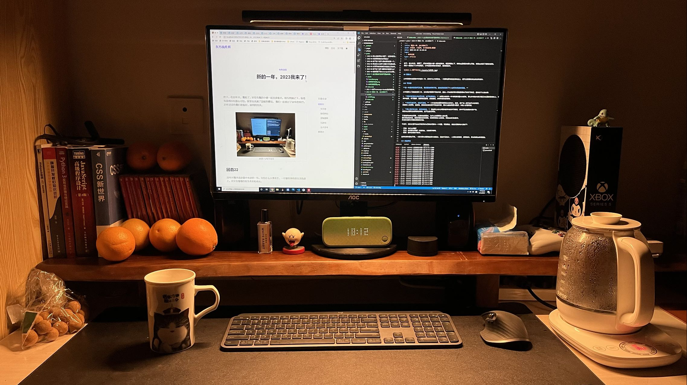

终于，在22年末，我阳了，好在有我的小睿一起共度难关。相互照顾之下，病毒也显得没有那么可怕，家里也充满了温暖的感觉。
我们一起度过了22年的尾巴，23年还没待我们准备好，就悄悄到来。

## 回首22

22年对我来说是稳中求进的一年。没有什么大事发生，一切都在原有的生活轨迹上，但又在慢慢的发生改变和成长。

### 写文章

**这一年我依旧坚持写文章，虽然更新频率不高，但也逐渐找到了个人的写作风格和思路。**

22年是我入门前端的第二年，会有很多需要学习的内容，因此一开始我的写作思路更倾向于做学习笔记，但其实不太适合我：

1. **用作笔记的方式去写文章，过于耗费精力。** 如果以单纯学一本书耗费的精力为标准，那么将书的内容以笔记方式更新到博客上，将多花3-4倍的精力，
其中包括，学习理解，整理笔记逻辑，反复查证，示例代码构思等等。

2. **内容又臭又长，定位不清晰。** 一本书的笔记量可想而知会非常大，最终，我产出一篇又臭又长的笔记，
我猜没人会想看，包括我。假设读者真的想学习这些内容，我认为直接看原书更好，毕竟人家更权威。

3. **网上笔记文太多，我没有特色。** 现在网上有太多面向初学者的学习笔记，其中不乏优质的内容产出。
我没有必要再去做同样的事情，这不过是无用功。

于是我开始转变思路，从我的角度思考，为什么会想看别人的文章？

- 如果我经验尚浅，碰到问题会没有思路，我想看看别人的思路，再结合自己的需求，
形成自己解决问题的思路和方案。
- 如果我经验丰富，参看别人的方案也可以让我取长补短，更进一步。

**总的来说，目前我的文章主要写问题的解决方案。写到现在，一篇文章从立意到大纲建立，已经行云流水，我写的时候几乎都会遵从三段式结构，一方面立意清晰，逻辑简单，再者篇幅也容易把控。**

1. 开篇：有什么问题？
2. 正文：如何解决问题？方案对比，方案细节等等。
3. 结尾：简单总结技术要点。

### 鼓捣网站

**22年，我完成了网站改版，并决定未来的一段时间，都采用目前的形式来维护和更新我的网站。**

我的网站原本采用前后端分离的模式。这让我的维护成本有点大，一方面我要写文章，另一方面，我要维护服务器，更新功能，前后端一起干。
其实建站的初衷只是写文章，但现在维护服务器，开发网站本身占据了我的主要时间，而且开发的功能出来也没人用。
因此我决定舍弃前后端分离的网站，纯静态网站更适合我，我应该将精力放在写文章上面。

于是我采用Next.js搭建了纯静态网站，今年我还在网站中运用了一项令人兴奋的新技术MDX。MDX其实就是支持react组件的markdown，
这样原本较为呆板的markdown文章有了更多的可能性，我可以开发更新奇的组件来丰富我的文章内容展示或交互。你们看到的这篇文章便是基于MDX产生的。
当前我对MDX的运用还很基础，没有发挥出其巨大的可能，这一部分的探索只能交给23年的我了。

除了改版网站，我还接触到`vercel`云平台，它被用来部署我的网站。有很多好处：
1. 免费的服务器资源
2. 持续集成和部署功能
3. 免费的域名

**这让我可以舍弃昂贵的阿里云，并完全从服务器的运维中解放，现在我只需要专心写文章就好了，写完上传到github，vercel会自动部署新版本网站，瑞斯拜！**

### 接触摄影

**除了文章和网站，我的生活也有新的元素加入进来-相机。**

在小睿想要拍视频的驱使下，我们在年中买入了人生中第一台相机，sony-zve10，这是一台入门的半幅相机。
不贵的价格，丰富的镜头群成为我选择它的理由。说来它其实是一台vlog相机，但我最喜欢的是用它来拍照，因为我对拍视频实在没有兴趣。

拿到相机的头几个月，我一边钻研相机和镜头的知识，什么光圈快门IOS，镜头的焦距，透视，构图等等，一边顶着炎炎夏日出门拍照，有一次还差点中暑。
拍照的过程其实比较累，我需要经历奔波，大量拍照，回家选片，后期调色。一般后期完成都是深夜10点了，但最终会看成片的时候，成就感还是满满的。
小睿老师则会指出我照片的问题，我心里不开心，但有时候其实说的很对，我接受之后往往都能拍出更好的片子。**这个过程中，我收获了好多惊喜，
很多的汗水和快乐，小睿也老是被我拉着出门一起拍照，不过她总是觉得很累，但还是愿意陪着我，我很开心。**

### 玩游戏

**劳逸结合，玩了一些优秀有趣的游戏。**

游戏方面，年初和小睿一起通关了双人成行，是一次难忘的游戏体验，我们两收获了很多快乐，不愧是21年的年度TAG游戏。
年尾的时候，还入手了一台XSS，这是除了NS外的第二台主机。

相比PC，我更愿意用XSS来体验游戏，唯一的缺点就是画质差了点，不过1600的机子，还没有一块入门显卡贵，也就不强求了。
但XSS的快速恢复，不错的手柄体验，超快的游戏打开速度，
沉浸的游戏体验，省心方便，这些都是我认为XSS更胜PC的地方，以后高低得整台XSX好吧。

除了主机游戏，我平时玩儿的最多的还是王者，我意识到自己老了，操作和反应都比不上从前，很多时候就是逞强，操作秀不出来，饭倒是给对面喂的饱饱的。
希望23年可以出一些轻松愉快的游戏，任天堂多多发力，期待下塞尔达王国之泪。最近在玩老头环，探索这个世界太好玩了，游戏是第九艺术，很好！

### 技术思考

**重要的不是技术，而是解决问题的思路，技术只是工具。**

往常我总会因为自己学会了某项新技术而沾沾自喜，我知道这样是不对的，但真正让我意识到技术只是工具的是我的leader。
leader后端出身，因此我对其后端水平非常信服，但是前端方向应该是我的长处。有时，我会碰到一些问题无法解决，leader虽然不是前端，但总能给出指导性的意见让我豁然开朗。
这让我意识到，**重要的不是技术，而是解决问题的思路，技术只是工具。思路只要对了，剩下的只是如何选择趁手的工具而已。**

近两年前端技术发展非常之快，大家都抱怨学不动了。但也有声音认为只要学好前端三剑客(js,html,css)，便可以不变应万变。我的想法也近乎类似，
新技术的迭代更新着实很快，但这些技术的迭代都只是深入了，例如构建工具，老牌的有webpack，rollup，gulp，后起之秀如vite，es-build，Turbopack等等。
它们完成的功能都是一样的，如果追求新技术，可以尝试新的构建工具带来的便利，成本是花时间学一学。也没有必要说出一门新技术就一定要学一学，有时间有激情就学，
没时间的了解一下，也不费事，这样未来有需求时，也不是一无所知。**对于一类技术，我认为可以精通一门，其余的了解其新特性即可，这样往往能够做到触类旁通，
等到有新技术的应用场景，就可以落地实践。**

**任何技术都是按需使用的，重要的还是解决问题的思路。不做只啃老本的人，也不必盲目追求新技术，分辨真正应该深入的技术方向，
培养好自己解决问题方式，才能遇事沉着，游刃有余。**

## 展望23

23年的愿望很简单。

**希望自己专心写好文章，继续拍照记录生活，保重身体，身体是革命本钱，在专业领域继续成长，和小睿一起走过新的一年，健康快乐，诸事顺利。希望这个世界可以快点好起来！**