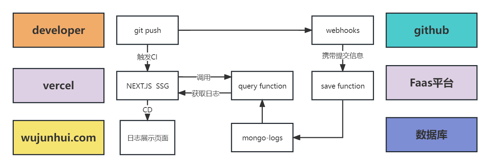

心血来潮，想给这个小站加上日志功能，一来可以看看成长历程，二来可以在自己颓废失意时，看看曾经的努力和付出，
兴许能从中获取一些力量。

## 灵光一闪

我的所有文章都是存放在git，而不是数据库中。所以文章或网站功能的更新内容，
都可以体现在git提交信息中。为了方便，我打算直接获取git提交记录作为网站更新日志，
并使用webhook实现日志自动更新功能，避免需要手动运维更新日志。

## 整体架构



过程中使用到的技术栈：

1. mongo。mongo的使用非常简单友好，无需关心表结构，官方的云数据库免费提供512M的容量，用来存储更新日志绰绰有余。

2. webhooks。为了避免手动运维，我通过webhooks完成提交信息的自动发送。

3. Faas。提供云函数供webhooks更新日志和网站构建时查询最新日志，同时我可以在云函数中连接mongo完成数据插入和查询。

4. Next.js。Next.js支持SSG(静态页面生成)，日志页面构建时，可以请求得到最新日志列表，并直接渲染为静态页面，提升客户端性能。

5. Vercel。Next项目部署在Vercel上，git提交时可以帮助我自动构建最新的网站内容并部署。

## 日志自动存储 WebHooks + Faas

日志更新过程如下，当我`git push`提交代码后，`WebHooks`会携带提交信息向部署在Faas平台的`云函数`发送POST请求，
云函数接收到提交信息后将其保存至`mongo数据库`。下面是云函数的代码：

```javascript
export default async function updateLog(req:NextApiRequest, res: NextApiResponse) {
  try {
    // 读取提交信息
    console.log("hook触发了！",req.body);
    const { head_commit, ref } = req.body;
    const {id, timestamp, message, author} = head_commit;
    const commitInfo = {
      hash: id,
      date: timestamp,
      message,
      refs: ref,
      body: "",
      author_name:author?.name,
      author_email: author?.email
    }
    // 调用mongo保存日志
    mongo.setCollection(COLLECTIONS.updateLog);
    await mongo.insert(commitInfo)
    res.status(200).json("ok");
  } catch (error) {
    console.error(error);
    res.status(500).json("update error!")
  }
}
```

为了安全起见，可以在webhooks种配置secret字段，配置完成后，webhooks发送POST请求时，便会将加密完成的密钥放在请求头中，
因此你可以对请求头中的密钥进行验证，防止日志被坏人无脑更新。验证过程如下：

```javascript
// 加密密钥
const gitToken = req.headers["x-hub-signature-256"]
const hamc =  createHmac("sha256", process.env.TOKEN).update(JSON.stringify(req.body)).digest("hex")
const shaHamc = "sha256=" + hamc
// 验证密钥
if (shaHamc !== gitToken) {
  res.status(500).json("not allow!")
}
```

这个过程中，请确保你的密钥不被泄露。

## 重新部署并拉取最新日志

git提交不仅会触发日志更新，同时也会触发vercel自动构建网站，这会经历以下几个步骤：

1. git pull      仓库最新代码拉取
2. yarn install  项目依赖安装
3. yarn build    Next.js构建，拉取最新日志，完成静态网站生成 
4. yarn serve    服务启动
5. Assigning Domains 域名注册

```javascript
export const getStaticProps = async ({ }: GetStaticPropsContext) => {
    // 查询mongo，静态渲染
    mongo.setCollection(COLLECTIONS.updateLog)
    const logs = await mongo.query({})
    return {
        props: {
            logs
        }
    };
};

const LogsPage: NextPage<InferGetStaticPropsType<typeof getStaticProps>> = ({
    logs
}) => {
    const { title, labels } = useIntroduce();    
    return (
        <Layout title="更新日志">
            {/* 渲染日志 */}
            {logs.map(item=><Log {...item} />)}
        </Layout>
    );
};
```

yarn build时，Next.js会运行getStaticProps，获取到最新的日志数据并注入页面，最后生成静态html。
由于yarn build执行前，会有依赖安装等长耗时操作，此时提交日志早已被插入mongo，
因此在`getStaticProps`时已能获取到最新的网站日志。

## git提交规范

为了方便我对网站的日志进行过滤展示，我对网站的提交日志做了简单的类型规范。

1. refactor (重构代码)
2. articel  (发布文章)
3. fix      (bug修复)
4. featrue  (新功能发布)

提交时，需要在commit message中加上上述前缀，所有的日志都可以被分类，除了fix，
其他3种类型的提交都会作为网站更新日志被展示。

## 总结

利用webhooks，我解决了网站日志需要手动运维更新的问题。还是很香的啦！
